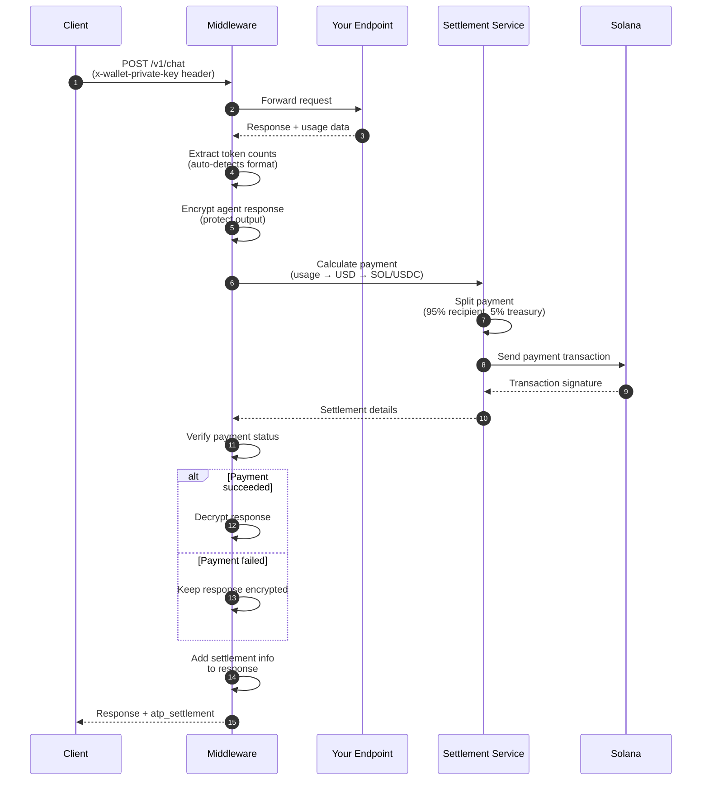
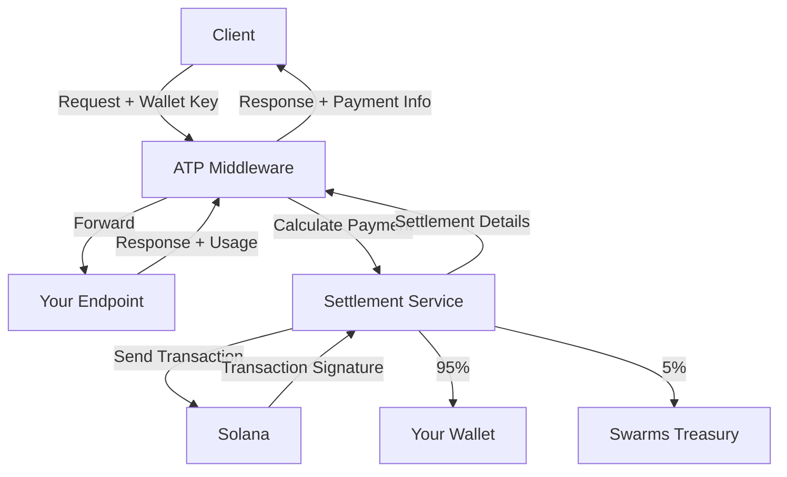

# ATP Protocol

**ATP (Agent Transaction Protocol)** enables automatic payment processing for AI agent APIs on Solana. Add billing to any FastAPI endpoint with a few lines of code.

> **Part of the [Swarms.ai](https://swarms.ai) ecosystem** - ATP Protocol is built for the [Swarms](https://github.com/kyegomez/swarms) multi-agent orchestration framework, providing seamless payment infrastructure for agent-to-agent transactions.

## What It Does

ATP Protocol makes it easy to charge for API usage:

- **Automatic billing** - Payment is processed automatically after each request
- **Solana payments** - Uses SOL or USDC for fast, cheap transactions
- **Token-based pricing** - Charges based on input/output token usage
- **Response encryption** - Agent responses are encrypted until payment is confirmed
- **Payment verification** - Responses are only decrypted after successful payment
- **Zero infrastructure** - No payment processors, no databases, just Solana

## Quick Start

First, install the package:

```bash
pip install atp-protocol
```

## Usage

Then add automatic billing to your FastAPI app:

```python
from fastapi import FastAPI
from atp.middleware import ATPSettlementMiddleware
from atp.schemas import PaymentToken

app = FastAPI()

# Add the middleware
app.add_middleware(
    ATPSettlementMiddleware,
    allowed_endpoints=["/v1/chat", "/v1/completions"],
    input_cost_per_million_usd=10.0,   # $10 per million input tokens
    output_cost_per_million_usd=30.0,  # $30 per million output tokens
    recipient_pubkey="YourSolanaWalletHere",  # Your wallet receives 95%
    payment_token=PaymentToken.SOL,
)

# Your endpoint just needs to return usage data
@app.post("/v1/chat")
async def chat(request: dict):
    return {
        "output": "Response here",
        "usage": {
            "input_tokens": 150,
            "output_tokens": 50,
        }
    }
```

**Client makes request:**

```bash
curl -X POST http://localhost:8000/v1/chat \
  -H "x-wallet-private-key: [1,2,3,...]" \
  -d '{"message": "Hello!"}'
```

**Response includes payment details (decrypted after payment):**

```json
{
  "output": "Response here",
  "usage": {"input_tokens": 150, "output_tokens": 50},
  "atp_settlement": {
    "status": "paid",
    "transaction_signature": "5j7s8K9...",
    "payment": {
      "total_amount_sol": 0.0003,
      "recipient": {"amount_sol": 0.000285},
      "treasury": {"amount_sol": 0.000015}
    }
  }
}
```

**If payment fails, response remains encrypted:**

```json
{
  "output": "encrypted_data_here...",
  "usage": {"input_tokens": 150, "output_tokens": 50},
  "atp_settlement": {
    "error": "Settlement failed",
    "message": "Insufficient funds"
  },
  "atp_settlement_status": "failed",
  "atp_message": "Agent response is encrypted. Payment required to decrypt. Please provide a valid wallet private key and ensure payment succeeds."
}
```

That's it! Payment is automatically processed on Solana, and responses are protected until payment is confirmed.

---

## How It Works

The ATP Protocol uses a **Settlement Service** to handle all payment logic. Here's the flow:



### Step-by-Step

1. **Client sends request** with wallet private key in header
2. **Middleware intercepts** and forwards to your endpoint
3. **Your endpoint executes** and returns response with usage data
4. **Middleware extracts** token counts (supports OpenAI, Anthropic, Google formats)
5. **Middleware encrypts** agent response to protect output until payment is confirmed
6. **Settlement Service calculates** cost from token usage
7. **Settlement Service splits** payment: 95% to you, 5% to Swarms Treasury
8. **Settlement Service sends** Solana transaction
9. **Middleware verifies** payment status from settlement service
10. **If payment succeeded**: Middleware decrypts response and returns it
11. **If payment failed**: Response remains encrypted with error message
12. **Middleware adds** settlement info to response

### Architecture



The **Settlement Service** is a centralized service that handles:

- Parsing usage data from various API formats
- Calculating payment amounts
- Executing Solana transactions
- Verifying payments

The official facilitator at **`https://facilitator.swarms.world`** is ultra-fast and powered by Rust, ensuring low-latency payment processing. This keeps your middleware simple and ensures all settlement logic is immutable and centralized.

---

## Configuration

### Required Parameters

| Parameter | Description |
| --------- | ----------- |
| `allowed_endpoints` | List of endpoint paths to apply settlement (e.g., `["/v1/chat"]`) |
| `input_cost_per_million_usd` | Cost per million input tokens in USD |
| `output_cost_per_million_usd` | Cost per million output tokens in USD |
| `recipient_pubkey` | Your Solana wallet address (receives 95% of payment) |

### Optional Parameters

| Parameter | Default | Description |
| --------- | ------- | ----------- |
| `wallet_private_key_header` | `x-wallet-private-key` | HTTP header name for wallet key |
| `payment_token` | `PaymentToken.SOL` | `PaymentToken.SOL` or `PaymentToken.USDC` |
| `require_wallet` | `True` | Require wallet key or skip settlement when missing |
| `settlement_service_url` | From `ATP_SETTLEMENT_URL` env | Settlement service URL |
| `settlement_timeout` | From `ATP_SETTLEMENT_TIMEOUT` env or `300.0` | Timeout in seconds for settlement requests (default: 5 minutes) |
| `fail_on_settlement_error` | `False` | If `True`, raises HTTPException on settlement failure; if `False`, returns encrypted response with error |
| `skip_preflight` | `False` | Skip Solana transaction preflight simulation |
| `commitment` | `"confirmed"` | Solana commitment level (`processed`\|`confirmed`\|`finalized`) |

### Environment Variables

```bash
# Settlement Service URL (default: https://facilitator.swarms.world)
# The official facilitator is ultra-fast and powered by Rust
ATP_SETTLEMENT_URL="https://facilitator.swarms.world"

# Settlement Service Timeout (default: 300.0 seconds / 5 minutes)
# Settlement operations may take longer due to blockchain confirmation times
# Increase this value if you experience timeout errors even when payments succeed
ATP_SETTLEMENT_TIMEOUT="300.0"

```

---

## Payment Calculation

The middleware calculates cost from token usage:

```text
usd_cost = (input_tokens / 1,000,000 × input_rate) + (output_tokens / 1,000,000 × output_rate)
token_amount = usd_cost / token_price_usd
```

**Payment Split:**

- **95%** → Your wallet (`recipient_pubkey`)
- **5%** → Swarms Treasury (processing fee)

The fee is **deducted from the total** (not added on top).

### Example

If a request uses 1,000 input tokens and 500 output tokens:

- Input cost: `1,000 / 1,000,000 × $10 = $0.01`
- Output cost: `500 / 1,000,000 × $30 = $0.015`
- **Total: $0.025 USD**

At SOL price of $100:

- Payment: `$0.025 / $100 = 0.00025 SOL`
- You receive: `0.00025 × 0.95 = 0.0002375 SOL`
- Treasury receives: `0.00025 × 0.05 = 0.0000125 SOL`

---

## Supported Usage Formats

The middleware automatically detects usage from common API formats:

- **OpenAI**: `prompt_tokens`, `completion_tokens`, `total_tokens`
- **Anthropic**: `input_tokens`, `output_tokens`, `total_tokens`
- **Google/Gemini**: `promptTokenCount`, `candidatesTokenCount`, `totalTokenCount`
- **Generic**: `input_tokens`, `output_tokens`, `total_tokens`
- **Nested**: `usage.*`, `meta.usage`, `statistics.*`

Your endpoint can return usage in any of these formats - the middleware will find it.

---

## Complete Example

```python
from fastapi import FastAPI, JSONResponse
from atp.middleware import ATPSettlementMiddleware
from atp.schemas import PaymentToken

app = FastAPI()

# Configure middleware
app.add_middleware(
    ATPSettlementMiddleware,
    allowed_endpoints=["/v1/chat"],
    input_cost_per_million_usd=10.0,
    output_cost_per_million_usd=30.0,
    recipient_pubkey="YourSolanaWalletHere",
    payment_token=PaymentToken.SOL,
    require_wallet=True,
    fail_on_settlement_error=False,  # Return encrypted response on error
    settlement_timeout=300.0,  # 5 minutes timeout
)

@app.post("/v1/chat")
async def chat(request: dict):
    # Your business logic here
    message = request.get("message", "")
    
    # Simulate API call that returns usage
    response_data = {
        "output": f"You said: {message}",
        "usage": {
            "input_tokens": len(message.split()) * 2,  # Rough estimate
            "output_tokens": 50,
            "total_tokens": len(message.split()) * 2 + 50,
        }
    }
    
    return JSONResponse(content=response_data)

if __name__ == "__main__":
    import uvicorn
    uvicorn.run(app, host="0.0.0.0", port=8000)
```

**Run it:**

```bash
python app.py
```

**Test it:**

```bash
curl -X POST http://localhost:8000/v1/chat \
  -H "Content-Type: application/json" \
  -H "x-wallet-private-key: [1,2,3,...]" \
  -d '{"message": "Hello, world!"}'
```

### Swarms Framework Integration

For a complete example showing how to integrate ATP Protocol with [Swarms](https://github.com/kyegomez/swarms) agents, see:

**[examples/example.py](examples/example.py)** or **[example.py](example.py)** (root directory)

This example demonstrates:

- Setting up a Swarms agent
- Creating FastAPI endpoints that use the agent
- Automatic payment processing with ATP middleware
- Usage tracking and billing for agent services

**Quick start with Swarms:**

```bash
# Install dependencies
pip install swarms atp-protocol

# Set your OpenAI API key
export OPENAI_API_KEY="your-key-here"

# Run the example
python examples/example.py
# or
python example.py
```

---

## Examples

ATP Protocol includes comprehensive examples showing how to integrate with various AI agent frameworks and APIs. All examples demonstrate automatic payment processing, token usage tracking, and Solana settlement.

### Framework Integration Examples

| Framework | Directory | Description | Documentation |
|-----------|-----------|-------------|--------------|
| **Swarms** | [`examples/swarms/`](examples/swarms/) | Swarms framework integration - native ATP Protocol support | [README](examples/swarms/README.md) |
| **LangChain** | [`examples/langchain/`](examples/langchain/) | LangChain agent integration with tools and conversational interface | [README](examples/langchain/README.md) |
| **AutoGen** | [`examples/autogen/`](examples/autogen/) | AutoGen multi-agent conversation framework integration | [README](examples/autogen/README.md) |
| **CrewAI** | [`examples/crewai/`](examples/crewai/) | CrewAI multi-agent crew workflows and task pipelines | [README](examples/crewai/README.md) |
| **Anthropic API** | [`examples/anthropic/`](examples/anthropic/) | Direct integration with Anthropic's Claude API | [README](examples/anthropic/README.md) |

### Standalone Examples

| Example | File | Description |
|---------|------|-------------|
| **Swarms Integration** | [`examples/example.py`](examples/example.py) | Complete Swarms framework integration example |
| **Full Flow** | [`examples/full_flow_example.py`](examples/full_flow_example.py) | End-to-end payment flow demonstration |
| **Settlement Service** | [`examples/settlement_service_example.py`](examples/settlement_service_example.py) | Direct settlement service usage |
| **Client Smoke Test** | [`examples/client_smoke_test.py`](examples/client_smoke_test.py) | Client testing and validation |

### Quick Start with Examples

Each example includes:
- **Server** (`server.py`) - FastAPI server with ATP middleware configured
- **Client** (`client.py`) - Example client with wallet authentication
- **README** - Framework-specific setup and usage instructions

**Getting started:**

1. Navigate to an example directory:
   ```bash
   cd examples/swarms  # or langchain, autogen, crewai, anthropic
   ```

2. Install dependencies (see example's README for specific requirements)

3. Configure environment variables:
   ```bash
   # Create .env file
   OPENAI_API_KEY="your-key"  # For Swarms, LangChain, AutoGen, CrewAI
   ANTHROPIC_API_KEY="your-key"  # For Anthropic
   ATP_PRIVATE_KEY="[1,2,3,...]"
   ```

4. Update `recipient_pubkey` in `server.py` with your Solana wallet address

5. Run the server:
   ```bash
   python server.py
   ```

6. Test with the client:
   ```bash
   python client.py
   ```

For detailed instructions, see the [Examples README](examples/README.md) or the framework-specific README in each example directory.

---

## Response Encryption & Payment Verification

ATP Protocol includes built-in **response encryption** to ensure users cannot access agent output until payment is confirmed. This provides strong protection against payment fraud.

### How It Works

1. **After endpoint execution**: The middleware encrypts sensitive response fields (e.g., `output`, `response`, `result`, `message`) before processing payment
2. **Payment processing**: Settlement is attempted via the Settlement Service
3. **Payment verification**: The middleware checks if payment status is `"paid"` and a transaction signature exists
4. **Conditional decryption**:
   - ✅ **Payment succeeded**: Response is decrypted and returned to client
   - ❌ **Payment failed**: Response remains encrypted with error message

### Encrypted Response Format

When payment fails, the response includes encrypted data and a clear message:

```json
{
  "output": "encrypted_data_here...",
  "usage": {"input_tokens": 150, "output_tokens": 50},
  "atp_settlement": {
    "error": "Settlement service unavailable",
    "message": "Request timed out after 300.0s. The payment may have been sent successfully, but the settlement service did not respond in time.",
    "type": "ReadTimeout"
  },
  "atp_settlement_status": "failed",
  "atp_message": "Agent response is encrypted. Payment required to decrypt. Please provide a valid wallet private key and ensure payment succeeds."
}
```

### Settlement Error Handling

The middleware provides flexible error handling via the `fail_on_settlement_error` parameter:

- **`fail_on_settlement_error=False`** (default):
  - Returns encrypted response with error details
  - Client receives usage data and error information
  - Useful for debugging and graceful degradation

- **`fail_on_settlement_error=True`**:
  - Raises `HTTPException` (500) when settlement fails
  - Request fails immediately
  - Useful for strict payment requirements

### Timeout Handling

Settlement operations may take time due to blockchain confirmation. The middleware provides informative timeout messages:

- **ReadTimeout**: Payment may have succeeded, but settlement service didn't respond in time
- **ConnectTimeout**: Settlement service is unreachable
- **HTTP errors**: Network or service errors with status codes

Increase `settlement_timeout` if you experience timeouts even when payments succeed.

---

## Error Handling

| Error Scenario              | Behavior                                                                                                              |
|----------------------------|-----------------------------------------------------------------------------------------------------------------------|
| **Missing wallet key**      | Returns `401 Unauthorized` if `require_wallet=True`                                                                  |
| **Missing usage data**      | Logs warning and returns original response (no settlement)                                                           |
| **Payment failure**         | If `fail_on_settlement_error=False`: Returns encrypted response with error details  <br> If `fail_on_settlement_error=True`: Returns `500 Internal Server Error` and raises exception |
| **Invalid private key**     | Returns `500 Internal Server Error` with parsing error                                                               |
| **Encryption failure**      | Returns `500 Internal Server Error` without exposing agent output                                                    |
| **Settlement timeout**      | Returns encrypted response with timeout message (payment may have succeeded)                                         |

---

## How the Settlement Service Works

The Settlement Service is a centralized API that handles all payment logic. The official facilitator service at **`https://facilitator.swarms.world`** is ultra-fast and powered by Rust, ensuring low-latency payment processing.

The service provides:

| Endpoint                                     | Description                        |
|----------------------------------------------|------------------------------------|
| **POST /v1/settlement/parse-usage**          | Parse usage from various formats   |
| **POST /v1/settlement/calculate-payment**    | Calculate payment amounts          |
| **POST /v1/settlement/settle**               | Execute payment transaction        |

The middleware calls these endpoints automatically. You can also call them directly if needed.

### Settlement Service Flow

1. **Parse usage** - Normalize token counts from any format
2. **Calculate cost** - Convert tokens to USD using your rates
3. **Fetch token price** - Get current SOL/USDC price
4. **Calculate payment** - Convert USD to token amount
5. **Split payment** - Calculate 95%/5% split
6. **Send transaction** - Execute Solana payment
7. **Verify** - Confirm transaction succeeded
8. **Return details** - Transaction signature and payment breakdown

All settlement logic is immutable and centralized in the service, ensuring consistency and reliability.

---

## Payment Tokens

ATP Protocol supports two payment tokens:

- **SOL** - Native Solana token (default)
- **USDC** - Stablecoin (treated as $1 USD)

Set `payment_token=PaymentToken.USDC` to use USDC instead of SOL.

---

## Security Considerations

| Security Aspect              | Details                                                           |
|------------------------------|-------------------------------------------------------------------|
| **Private keys**             | Only used in-memory during each request                           |
| **No key storage**           | Keys are never persisted                                          |
| **Settlement Service**       | Handles all sensitive operations                                  |
| **Response encryption**      | Agent outputs are encrypted until payment is confirmed            |
| **Payment verification**     | Responses are only decrypted after successful payment verification |
| **Transaction verification** | Ensures payments are confirmed before a response is returned      |
| **Encrypted failure mode**   | Failed payments keep responses encrypted, preventing output access |

---

## About Swarms

ATP Protocol is part of the **[Swarms](https://swarms.ai)** ecosystem, the enterprise-grade production-ready multi-agent orchestration framework. Swarms provides the infrastructure for building and deploying autonomous agents at scale.

- **Framework**: [Swarms on GitHub](https://github.com/kyegomez/swarms)
- **Documentation**: [docs.swarms.world](https://docs.swarms.world)
- **Website**: [swarms.ai](https://swarms.ai)

ATP Protocol integrates seamlessly with Swarms agents, enabling agent-to-agent payments and automatic billing for agent services built on the Swarms framework.

---

## License

See [LICENSE](LICENSE) file for details.
