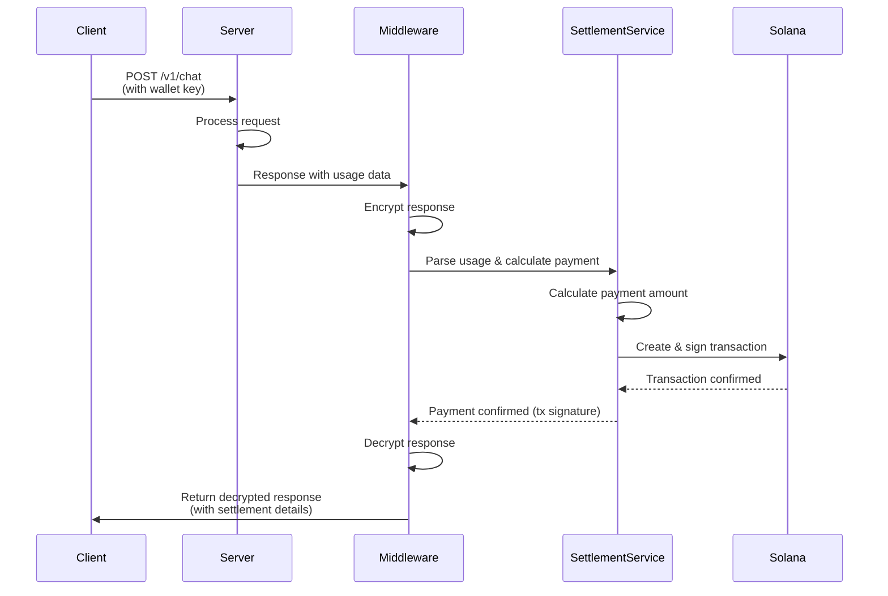

# ATP: Agent Trade Protocol

> The premier agent-to-agent payment protocol and foundational framework to empower the agent economy.

[](https://www.python.org/downloads/)
[](https://opensource.org/licenses/MIT)
[](https://docs.swarms.ai/docs/atp/overview)

## Overview

ATP (Agent Trade Protocol) is the premier agent-to-agent payment protocol that will be the foundational framework to empower the agent economy. Designed to overcome x402's issues and make agent-to-agent payments dynamic and simple, ATP enables automatic payment processing for agent services on the Solana blockchain. The protocol provides a middleware layer that automatically deducts payments from user wallets based on token usage, ensuring secure and transparent transactions.

### Key Features

- **Security**: Response encryption ensures users cannot access output until payment is confirmed on-chain
- **Automation**: Zero-configuration payment processing through middleware integration
- **Decentralization**: All payments executed on Solana blockchain with full transaction visibility
- **Format Flexibility**: Supports multiple usage formats (OpenAI, Anthropic, Google, etc.) automatically
- **Transparency**: Automatic payment splitting between treasury and recipient wallets

## Architecture

ATP Protocol operates through three main components:

1. **Settlement Service (Facilitator)**: Centralized service handling all settlement logic, usage parsing, payment calculation, and blockchain transaction execution
2. **Middleware**: FastAPI middleware that intercepts API responses, extracts usage data, encrypts responses, executes payments, and decrypts responses only after payment confirmation
3. **Client**: User-facing client that simplifies making requests to ATP-protected endpoints and interacting with the settlement service

### Request Flow



## Quick Start

### Installation

```bash
pip install atp-protocol
```

### Server Setup (5 minutes)

Add ATP middleware to your FastAPI server:

```python
from fastapi import FastAPI
from fastapi.responses import JSONResponse
from atp.middleware import ATPSettlementMiddleware
from atp.schemas import PaymentToken

app = FastAPI(title="My ATP-Protected API")

# Add ATP Settlement Middleware
app.add_middleware(
    ATPSettlementMiddleware,
    allowed_endpoints=["/v1/chat", "/v1/completions"],
    input_cost_per_million_usd=10.0,  # $10 per million input tokens
    output_cost_per_million_usd=30.0,  # $30 per million output tokens
    recipient_pubkey="YourSolanaWalletPublicKeyHere",  # Your wallet
    payment_token=PaymentToken.SOL,  # SOL or USDC
    wallet_private_key_header="x-wallet-private-key",
    require_wallet=True,
)

@app.post("/v1/chat")
async def chat(request: dict):
    """Agent endpoint with automatic payment processing."""
    message = request.get("message", "")
    
    # Agent logic implementation
    response_text = "Agent response here"
    
    # Return response with usage data
    # Middleware handles payment processing automatically
    return JSONResponse(content={
        "response": response_text,
        "usage": {
            "input_tokens": 100,
            "output_tokens": 50,
            "total_tokens": 150
        }
    })
```

### Client Usage

```python
from atp.client import ATPClient

# Initialize client with wallet
client = ATPClient(
    wallet_private_key="[1,2,3,...]",  # Your wallet private key
    settlement_service_url="https://facilitator.swarms.world"
)

# Make request with automatic payment processing
response = await client.post(
    url="https://api.example.com/v1/chat",
    json={"message": "Hello!"}
)

print(response["response"])  # Agent output
print(response["atp_settlement"])  # Payment details
```

## Examples

Below is a comprehensive table of example integrations and usage:

| Category                | Example Link                                                                 | Description                                      |
|-------------------------|------------------------------------------------------------------------------|--------------------------------------------------|
| **Framework Integration** | [Swarms Framework](./examples/tutorials/swarms/)               | Enterprise multi-agent orchestration              |
| **Framework Integration** | [LangChain](./examples/tutorials/langchain/)                   | Popular Python LLM framework                      |
| **Framework Integration** | [AutoGen](./examples/tutorials/autogen/)                       | Microsoft's multi-agent framework                 |
| **Framework Integration** | [CrewAI](./examples/tutorials/crewai/)                         | Multi-agent orchestration                         |
| **Framework Integration** | [Anthropic](./examples/tutorials/anthropic/)                   | Claude API integration                            |
| **Client Example**        | [Health Check](./examples/client/example_health_check.py)        | Check settlement service status                   |
| **Client Example**        | [Parse Usage](./examples/client/example_parse_usage.py)          | Parse usage from various formats                  |
| **Client Example**        | [Calculate Payment](./examples/client/example_calculate_payment.py) | Calculate payment without executing           |
| **Client Example**        | [Execute Settlement](./examples/client/example_settle.py)        | Direct settlement execution                       |
| **Client Example**        | [Make Request](./examples/client/example_request.py)             | Request ATP-protected endpoints                   |
| **Server Example**        | [Basic Example](./examples/server/example.py)                    | Simple middleware setup                           |
| **Server Example**        | [Full Flow](./examples/server/full_flow_example.py)              | Complete payment flow                             |
| **Server Example**        | [Settlement Service](./examples/server/settlement_service_example.py) | Direct service usage                        |

See [examples/README.md](./examples/README.md) for complete documentation.


## Security Features

| Feature                | Description                                                                                                                                         |
|------------------------|-----------------------------------------------------------------------------------------------------------------------------------------------------|
| **Response Encryption**    | Agent responses are **encrypted before payment verification**, ensuring users cannot see output until payment is confirmed on-chain.                 |
| **Payment Verification**   | Responses are only decrypted after successful blockchain transaction confirmation (`status="paid"` with valid transaction signature).                  |
| **Error Handling**         | Failed payments result in encrypted responses with error details, preventing unauthorized access to agent output.                                   |


## Payment Structure

Payments are automatically split between:

- **Treasury**: Receives processing fee (default 5%, configured on settlement service)
- **Recipient**: Receives remainder (95% by default) - your wallet specified via `recipient_pubkey`

### Supported Payment Tokens

- **SOL** (Solana native token)
- **USDC** (USD Coin on Solana)

## Usage Data Formats

The middleware automatically supports multiple usage formats:

### OpenAI Format

```json
{
  "usage": {
    "prompt_tokens": 100,
    "completion_tokens": 50,
    "total_tokens": 150
  }
}
```

### Anthropic Format

```json
{
  "usage": {
    "input_tokens": 100,
    "output_tokens": 50
  }
}
```

### Google/Gemini Format

```json
{
  "usageMetadata": {
    "promptTokenCount": 100,
    "candidatesTokenCount": 50,
    "totalTokenCount": 150
  }
}
```

The settlement service automatically detects and parses these formats, so you can use any format your agent API returns.

## Configuration

### Environment Variables

```bash
# Settlement Service
ATP_SETTLEMENT_URL="https://facilitator.swarms.world"  # Default
ATP_SETTLEMENT_TIMEOUT=300.0  # 5 minutes (default)

# Encryption (optional - generates new key if not set)
ATP_ENCRYPTION_KEY="base64-encoded-fernet-key"
```

### Middleware Configuration

```python
app.add_middleware(
    ATPSettlementMiddleware,
    allowed_endpoints=["/v1/chat"],  # Endpoints to protect
    input_cost_per_million_usd=10.0,  # Pricing
    output_cost_per_million_usd=30.0,
    recipient_pubkey="YourWalletPublicKey",  # Required
    payment_token=PaymentToken.SOL,  # SOL or USDC
    wallet_private_key_header="x-wallet-private-key",
    require_wallet=True,  # Require wallet for payment
    settlement_service_url="https://facilitator.swarms.world",
    settlement_timeout=300.0,
    fail_on_settlement_error=False,  # Graceful error handling
)
```

## API Reference

### Middleware

The `ATPSettlementMiddleware` class provides automatic payment processing for FastAPI endpoints.

**Key Features:**

- Automatic usage parsing from multiple formats
- Response encryption before payment
- Payment execution via settlement service
- Response decryption after payment confirmation

See [Middleware Documentation](./atp/middleware.py) for complete API reference.

### Client

The `ATPClient` class provides a simple interface for:

- Making requests to ATP-protected endpoints
- Interacting with the settlement service directly
- Parsing usage data
- Calculating payments
- Executing settlements

See [Client Documentation](./atp/client.py) for complete API reference.

### Settlement Service

The settlement service (facilitator) handles:

- Usage parsing from various formats
- Payment calculation
- Blockchain transaction creation and execution
- Transaction confirmation

See [Settlement Service Documentation](https://docs.swarms.ai/docs/atp/facilitator) for complete API reference.


## Development

### Requirements

- Python 3.10+
- FastAPI (for middleware)
- Solana wallet (for payments)

### Installation from Source

```bash
git clone https://github.com/The-Swarm-Corporation/ATP-Protocol.git
cd ATP-Protocol
pip install -e .
```

### Running Tests

```bash
pytest tests/
```

### Code Quality

```bash
# Format code
black .

# Lint code
ruff check .
```


## Error Handling

### Missing Wallet Key

If wallet private key is missing and `require_wallet=True`:

```json
{
  "detail": "Missing wallet private key in header: x-wallet-private-key"
}
```

Status: `401 Unauthorized`

### Payment Failure

If payment fails and `fail_on_settlement_error=False` (default):

```json
{
  "response": "encrypted_data_here",
  "response_encrypted": true,
  "atp_settlement": {
    "error": "Settlement failed",
    "detail": "Insufficient funds",
    "status_code": 400
  },
  "atp_settlement_status": "failed",
  "atp_message": "Agent response is encrypted. Payment required to decrypt."
}
```

The response remains encrypted until payment succeeds.

## Best Practices

1. **Wallet Security**: Never log or persist wallet private keys. Use them only in-memory for transaction signing.

2. **Error Handling**: Use `fail_on_settlement_error=False` for graceful degradation. Check `atp_settlement_status` in responses to handle payment failures appropriately.

3. **Timeout Configuration**: Increase `settlement_timeout` if you experience timeout errors. Blockchain confirmation can take time depending on network conditions.

4. **Usage Data**: Always include accurate token counts in your responses. Middleware skips settlement if usage data cannot be parsed.

5. **Testing**: Use testnet wallets and small amounts for testing. Verify transactions on Solana explorer before production deployment.

6. **Monitoring**: Monitor `atp_settlement_status` in responses to track payment success rates and identify potential issues.

## Resources

| Resource                         | Description                        |
|-----------------------------------|------------------------------------|
| [Full Documentation](https://docs.swarms.ai/docs/atp/overview)         | Complete API documentation         |
| [Settlement Service API](https://docs.swarms.ai/docs/atp/facilitator)  | Facilitator API reference          |
| [Middleware Reference](https://docs.swarms.ai/docs/atp/middleware)      | Middleware configuration           |
| [Client Reference](https://docs.swarms.ai/docs/atp/client)             | Client API reference               |
| [ATP Vision](https://docs.swarms.ai/docs/atp/vision)                   | Protocol vision and roadmap        |


## Contributing

Contributions are welcome. Please read our contributing guidelines and submit pull requests for review.

## License

This project is licensed under the MIT License. See the [LICENSE](LICENSE) file for details.

## Acknowledgments

Built by [The Swarm Corporation](https://swarms.ai) to enable agent-to-agent commerce on the blockchain.

---

For additional information, see the [examples directory](./examples/) or the [complete documentation](https://docs.swarms.ai/docs/atp/overview).
