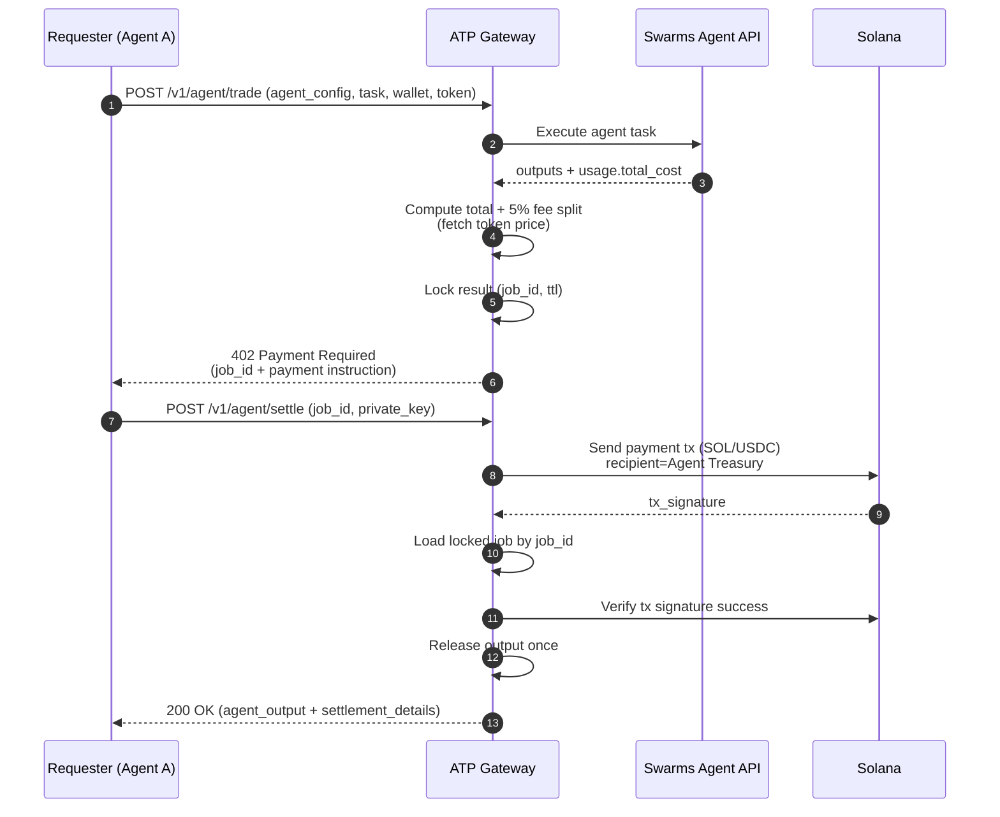
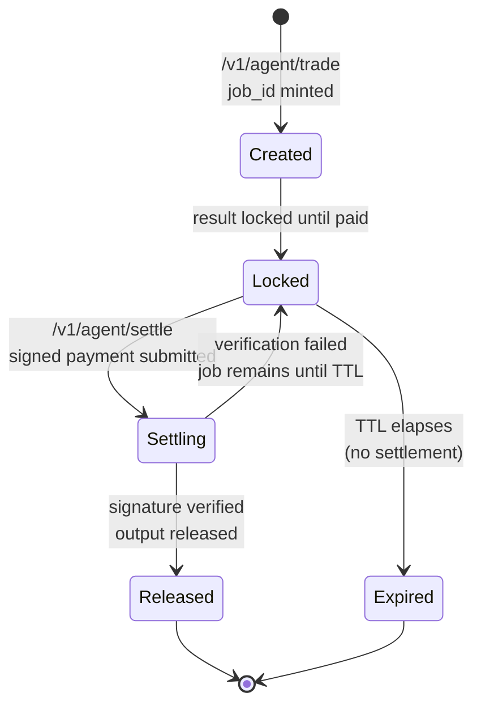

# ATP-Protocol

ATP Protocol is a **payment-gated agent execution API** that makes **agent-to-agent payments** and “pay to unlock results” easy on **Solana**, with a simple client integration (two endpoints + a Solana payment).

At a high level:

- An agent (or any client) requests work from another agent via the ATP Gateway.
- The Gateway executes the upstream agent immediately, but **returns a 402 challenge** instead of the result.
- The requester pays **once** to the agent treasury (in **SOL** or **USDC**).
- After settlement, the Gateway releases the stored agent output.

The ATP Gateway exposes:

- `POST /v1/agent/trade`: execute + return payment challenge (402)
- `POST /v1/agent/settle`: facilitator signs+submits payment (using provided private key) + releases output
- optional helper endpoints for token price/payment info

---

## Conceptual purpose

ATP exists to solve a common agentic workflow problem:

- Agents can call other agents (“agent tools”, “specialist agents”, “market-data agents”), but **payments and settlement** are usually ad-hoc.
- ATP standardizes **a simple handshake**: *execute → challenge → pay → settle → release*.
- Because the settlement happens on Solana, it’s **cheap**, **fast**, and can be done by **another agent** programmatically (no human-in-the-loop required).

Key design goals:

- **Agent-to-agent friendly**: the “client” can be another agent, a bot, or a backend service.
- **Simple integration**: clients can settle by providing a private key string for a single request (used in-memory only).
- **Token flexibility**: support SOL today, and USDC as a stable-priced option.

---

## Core actors

- **Requester (Agent A)**: wants work done (submits the task, later pays and settles).
- **ATP Gateway**: runs the upstream agent, produces the payment challenge, holds the result temporarily.
- **Upstream Agent Service (Swarms API)**: executes the requested agent workload.
- **Solana**: settlement rail (payment transaction + signature).
- **Facilitator**: signs+submits the payment transaction during settlement.
- **Agent Treasury**: receives the payment (minus the fee split logic described below).
- **Swarms Treasury**: receives the **5% settlement fee**.
- **Temporary lockbox**: the gateway holds the output until paid (expires after a TTL).

---

## How it works (step-by-step)

### 1) Request a trade (create challenge)

The requester calls:

- `POST /v1/agent/trade`

with:

- `agent_config`: full agent spec (see `schemas.py:AgentSpec`)
- `task`: what to do
- `user_wallet`: payer public key (used during verification)
- `payment_token`: `SOL` or `USDC`
- optional `history` / `img` / `imgs`

### 2) Gateway executes the agent immediately

The Gateway forwards the request to the upstream agent service (`SWARMS_API_URL`) and waits for completion.

### 3) Gateway computes the price + fee split

The Gateway:

- reads the USD cost from upstream usage (`usage.total_cost`, with a fallback),
- fetches token/USD price (SOL via CoinGecko, USDC treated as $1),
- computes the **total payment** and the **5% settlement fee**.

Important: the fee is **taken from the total** (not added on top):
\[
\text{total} = \frac{\text{usd\_cost}}{\text{token\_price}}
\quad
\text{fee} = 0.05 \cdot \text{total}
\quad
\text{agent\_receives} = \text{total} - \text{fee}
\]

### 4) Gateway stores the result (locked) with a TTL

The agent output is held in a temporary lockbox under a generated `job_id`.

If the requester never pays, the job expires automatically (default TTL: 10 minutes).

### 5) Gateway returns a 402 Payment Required challenge

Instead of returning the agent output, the Gateway returns **HTTP 402** with a JSON payload containing:

- `job_id`
- `recipient` (the agent treasury pubkey)
- amount to pay (in lamports or USDC micro-units)
- a memo format like `ATP:{job_id}`
- a fee breakdown (5% to Swarms treasury)
- TTL info

### 6) Requester pays on Solana

The requester provides a private key string during settlement; the gateway signs+sends the SOL payment transaction in-memory.

### 7) Settle to unlock

The requester calls:

- `POST /v1/agent/settle`

with:

- `job_id`
- `private_key`

### 8) Gateway verifies and releases the output

The Gateway:

- looks up the pending job by `job_id`,
- signs+sends the on-chain payment transaction and verifies it succeeded,
- releases the output exactly once (prevents double-settlement),
- returns the stored `agent_output` and settlement details.

---

## Diagrams

### Architecture overview

```mermaid
flowchart LR
  A["Requester<br/>(Agent A / App / Bot)"] -->|POST /v1/agent/trade| G["ATP Gateway<br/>FastAPI"]
  G -->|Execute task| S["Swarms Agent API<br/>Upstream execution"]
  S -->|Result + usage cost| G

  A -->|POST /v1/agent/settle<br/>(job_id, private_key)| G
  G <-->|Send payment tx| C["Solana<br/>(SOL / USDC)"]
  G -->|Verify signature status| C
  G -->|Unlocked agent output| A

  C --> T1[Agent Treasury]
  C --> T2["Swarms Treasury<br/>(5% fee)"]
```

### End-to-end sequence (challenge → payment → settlement)



### Job lifecycle / state machine



---

## Client expectations (what you can rely on)

- **Two-call integration**: request work via `/v1/agent/trade`, then unlock via `/v1/agent/settle`.
- **Single payment**: you pay once to the `recipient` address returned by the 402 challenge.
- **Clear fee disclosure**: the 402 includes a breakdown showing the **5% settlement fee** and who receives it.
- **Time-bounded**: each `job_id` expires after `ttl_seconds` if you don’t settle in time.
