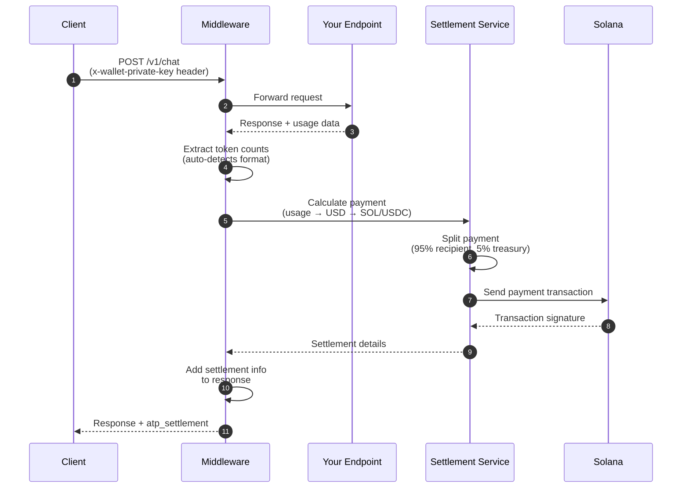
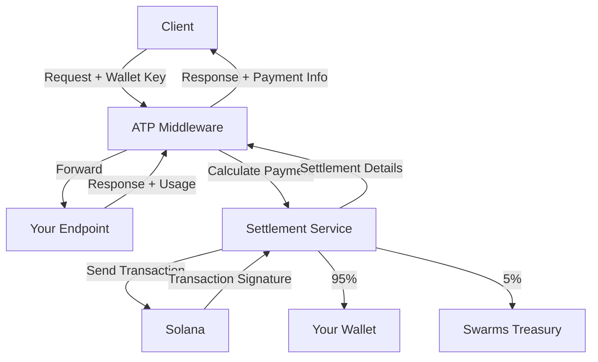

# ATP Protocol

**ATP (Agent Transaction Protocol)** enables automatic payment processing for AI agent APIs on Solana. Add billing to any FastAPI endpoint with a few lines of code.

> **Part of the [Swarms.ai](https://swarms.ai) ecosystem** - ATP Protocol is built for the [Swarms](https://github.com/kyegomez/swarms) multi-agent orchestration framework, providing seamless payment infrastructure for agent-to-agent transactions.

## What It Does

ATP Protocol makes it easy to charge for API usage:

- **Automatic billing** - Payment is processed automatically after each request
- **Solana payments** - Uses SOL or USDC for fast, cheap transactions
- **Token-based pricing** - Charges based on input/output token usage
- **Zero infrastructure** - No payment processors, no databases, just Solana

## Quick Start

First, install the package:

```bash
pip install atp-protocol
```

## Usage

Then add automatic billing to your FastAPI app:

```python
from fastapi import FastAPI
from atp.middleware import ATPSettlementMiddleware
from atp.schemas import PaymentToken

app = FastAPI()

# Add the middleware
app.add_middleware(
    ATPSettlementMiddleware,
    allowed_endpoints=["/v1/chat", "/v1/completions"],
    input_cost_per_million_usd=10.0,   # $10 per million input tokens
    output_cost_per_million_usd=30.0,  # $30 per million output tokens
    recipient_pubkey="YourSolanaWalletHere",  # Your wallet receives 95%
    payment_token=PaymentToken.SOL,
)

# Your endpoint just needs to return usage data
@app.post("/v1/chat")
async def chat(request: dict):
    return {
        "output": "Response here",
        "usage": {
            "input_tokens": 150,
            "output_tokens": 50,
        }
    }
```

**Client makes request:**

```bash
curl -X POST http://localhost:8000/v1/chat \
  -H "x-wallet-private-key: [1,2,3,...]" \
  -d '{"message": "Hello!"}'
```

**Response includes payment details:**

```json
{
  "output": "Response here",
  "usage": {"input_tokens": 150, "output_tokens": 50},
  "atp_settlement": {
    "status": "paid",
    "transaction_signature": "5j7s8K9...",
    "payment": {
      "total_amount_sol": 0.0003,
      "recipient": {"amount_sol": 0.000285},
      "treasury": {"amount_sol": 0.000015}
    }
  }
}
```

That's it! Payment is automatically processed on Solana.

---

## How It Works

The ATP Protocol uses a **Settlement Service** to handle all payment logic. Here's the flow:



### Step-by-Step

1. **Client sends request** with wallet private key in header
2. **Middleware intercepts** and forwards to your endpoint
3. **Your endpoint executes** and returns response with usage data
4. **Middleware extracts** token counts (supports OpenAI, Anthropic, Google formats)
5. **Settlement Service calculates** cost from token usage
6. **Settlement Service splits** payment: 95% to you, 5% to Swarms Treasury
7. **Settlement Service sends** Solana transaction
8. **Middleware adds** settlement info to response

### Architecture



The **Settlement Service** is a centralized service that handles:

- Parsing usage data from various API formats
- Calculating payment amounts
- Executing Solana transactions
- Verifying payments

This keeps your middleware simple and ensures all settlement logic is immutable and centralized.

---

## Configuration

### Required Parameters

| Parameter | Description |
| --------- | ----------- |
| `allowed_endpoints` | List of endpoint paths to apply settlement (e.g., `["/v1/chat"]`) |
| `input_cost_per_million_usd` | Cost per million input tokens in USD |
| `output_cost_per_million_usd` | Cost per million output tokens in USD |
| `recipient_pubkey` | Your Solana wallet address (receives 95% of payment) |

### Optional Parameters

| Parameter | Default | Description |
| --------- | ------- | ----------- |
| `wallet_private_key_header` | `x-wallet-private-key` | HTTP header name for wallet key |
| `payment_token` | `PaymentToken.SOL` | `PaymentToken.SOL` or `PaymentToken.USDC` |
| `require_wallet` | `True` | Require wallet key or skip settlement when missing |
| `settlement_service_url` | From `ATP_SETTLEMENT_URL` env | Settlement service URL |
| `skip_preflight` | `False` | Skip Solana transaction preflight simulation |
| `commitment` | `"confirmed"` | Solana commitment level (`processed`\|`confirmed`\|`finalized`) |

### Environment Variables

```bash
# Settlement Service URL (default: https://facilitator.swarms.world)
ATP_SETTLEMENT_URL="https://facilitator.swarms.world"

# Solana RPC URL (default: https://api.mainnet-beta.solana.com)
SOLANA_RPC_URL="https://api.mainnet-beta.solana.com"
```

---

## Payment Calculation

The middleware calculates cost from token usage:

```text
usd_cost = (input_tokens / 1,000,000 × input_rate) + (output_tokens / 1,000,000 × output_rate)
token_amount = usd_cost / token_price_usd
```

**Payment Split:**

- **95%** → Your wallet (`recipient_pubkey`)
- **5%** → Swarms Treasury (processing fee)

The fee is **deducted from the total** (not added on top).

### Example

If a request uses 1,000 input tokens and 500 output tokens:

- Input cost: `1,000 / 1,000,000 × $10 = $0.01`
- Output cost: `500 / 1,000,000 × $30 = $0.015`
- **Total: $0.025 USD**

At SOL price of $100:

- Payment: `$0.025 / $100 = 0.00025 SOL`
- You receive: `0.00025 × 0.95 = 0.0002375 SOL`
- Treasury receives: `0.00025 × 0.05 = 0.0000125 SOL`

---

## Supported Usage Formats

The middleware automatically detects usage from common API formats:

- **OpenAI**: `prompt_tokens`, `completion_tokens`, `total_tokens`
- **Anthropic**: `input_tokens`, `output_tokens`, `total_tokens`
- **Google/Gemini**: `promptTokenCount`, `candidatesTokenCount`, `totalTokenCount`
- **Generic**: `input_tokens`, `output_tokens`, `total_tokens`
- **Nested**: `usage.*`, `meta.usage`, `statistics.*`

Your endpoint can return usage in any of these formats - the middleware will find it.

---

## Complete Example

```python
from fastapi import FastAPI, JSONResponse
from atp.middleware import ATPSettlementMiddleware
from atp.schemas import PaymentToken

app = FastAPI()

# Configure middleware
app.add_middleware(
    ATPSettlementMiddleware,
    allowed_endpoints=["/v1/chat"],
    input_cost_per_million_usd=10.0,
    output_cost_per_million_usd=30.0,
    recipient_pubkey="YourSolanaWalletHere",
    payment_token=PaymentToken.SOL,
    require_wallet=True,
)

@app.post("/v1/chat")
async def chat(request: dict):
    # Your business logic here
    message = request.get("message", "")
    
    # Simulate API call that returns usage
    response_data = {
        "output": f"You said: {message}",
        "usage": {
            "input_tokens": len(message.split()) * 2,  # Rough estimate
            "output_tokens": 50,
            "total_tokens": len(message.split()) * 2 + 50,
        }
    }
    
    return JSONResponse(content=response_data)

if __name__ == "__main__":
    import uvicorn
    uvicorn.run(app, host="0.0.0.0", port=8000)
```

**Run it:**

```bash
python app.py
```

**Test it:**

```bash
curl -X POST http://localhost:8000/v1/chat \
  -H "Content-Type: application/json" \
  -H "x-wallet-private-key: [1,2,3,...]" \
  -d '{"message": "Hello, world!"}'
```

---

## Error Handling

- **Missing wallet key**: Returns `401 Unauthorized` if `require_wallet=True`
- **Missing usage data**: Logs warning and returns original response (no settlement)
- **Payment failure**: Returns `500 Internal Server Error` with error details
- **Invalid private key**: Returns `500 Internal Server Error` with parsing error

---

## How the Settlement Service Works

The Settlement Service is a centralized API that handles all payment logic. It provides:

- **`POST /v1/settlement/parse-usage`** - Parse usage from various formats
- **`POST /v1/settlement/calculate-payment`** - Calculate payment amounts
- **`POST /v1/settlement/settle`** - Execute payment transaction

The middleware calls these endpoints automatically. You can also call them directly if needed.

### Settlement Service Flow

1. **Parse usage** - Normalize token counts from any format
2. **Calculate cost** - Convert tokens to USD using your rates
3. **Fetch token price** - Get current SOL/USDC price
4. **Calculate payment** - Convert USD to token amount
5. **Split payment** - Calculate 95%/5% split
6. **Send transaction** - Execute Solana payment
7. **Verify** - Confirm transaction succeeded
8. **Return details** - Transaction signature and payment breakdown

All settlement logic is immutable and centralized in the service, ensuring consistency and reliability.

---

## Payment Tokens

ATP Protocol supports two payment tokens:

- **SOL** - Native Solana token (default)
- **USDC** - Stablecoin (treated as $1 USD)

Set `payment_token=PaymentToken.USDC` to use USDC instead of SOL.

---

## Security Considerations

| Security Aspect              | Details                                                           |
|------------------------------|-------------------------------------------------------------------|
| **Private keys**             | Only used in-memory during each request                           |
| **No key storage**           | Keys are never persisted                                          |
| **Settlement Service**       | Handles all sensitive operations                                  |
| **Transaction verification** | Ensures payments are confirmed before a response is returned      |

---

## About Swarms.ai

ATP Protocol is part of the **[Swarms](https://swarms.ai)** ecosystem, the enterprise-grade production-ready multi-agent orchestration framework. Swarms provides the infrastructure for building and deploying autonomous agents at scale.

- **Framework**: [Swarms on GitHub](https://github.com/kyegomez/swarms)
- **Documentation**: [docs.swarms.world](https://docs.swarms.world)
- **Website**: [swarms.ai](https://swarms.ai)

ATP Protocol integrates seamlessly with Swarms agents, enabling agent-to-agent payments and automatic billing for agent services built on the Swarms framework.

---

## License

See [LICENSE](LICENSE) file for details.
