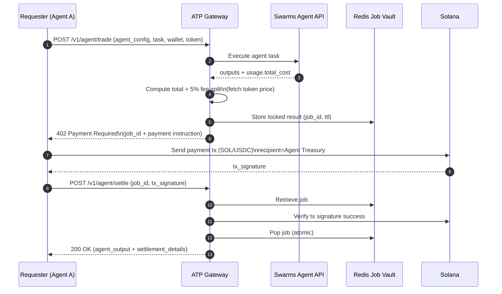
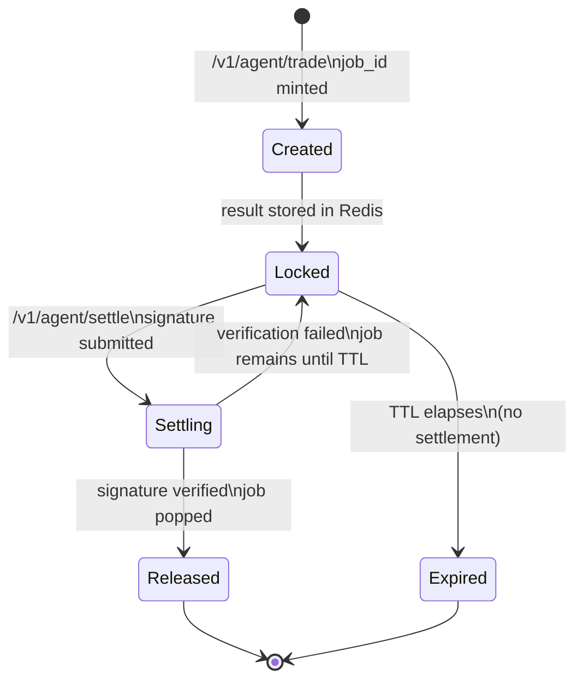

# ATP-Protocol

ATP Protocol is a **payment-gated execution gateway** that makes **agent-to-agent payments** and “pay to unlock results” easy on **Solana**, with **simple onboarding** (one HTTP API + a treasury address).

At a high level:
- An agent (or any client) requests work from another agent via the ATP Gateway.
- The Gateway executes the upstream agent immediately, but **returns a 402 challenge** instead of the result.
- The requester pays **once** to the agent treasury (in **SOL** or **USDC**).
- After settlement, the Gateway releases the stored agent output.

The current implementation lives in `api.py` and exposes:
- `POST /v1/agent/trade`: execute + return payment challenge (402)
- `POST /v1/agent/settle`: verify payment + release output
- `GET /health`, plus a few helper endpoints for token price/payment info

---

## Conceptual purpose

ATP exists to solve a common agentic workflow problem:

- Agents can call other agents (“agent tools”, “specialist agents”, “market-data agents”), but **payments and settlement** are usually ad-hoc.
- ATP standardizes **a simple handshake**: *execute → challenge → pay → settle → release*.
- Because the settlement happens on Solana, it’s **cheap**, **fast**, and can be done by **another agent** programmatically (no human-in-the-loop required).

Key design goals:
- **Agent-to-agent friendly**: the “client” can be another agent, a bot, or a backend service.
- **Simple onboarding**: run a gateway + set `AGENT_TREASURY_PUBKEY` and `SWARMS_API_KEY`.
- **No custody**: ATP verifies a payment transaction signature; it does not manage private keys.
- **Token flexibility**: support SOL today, and USDC as a stable-priced option.

---

## Core actors

- **Requester (Agent A)**: wants work done (submits the task, later pays and settles).
- **ATP Gateway**: runs the upstream agent, produces the payment challenge, holds the result temporarily.
- **Upstream Agent Service (Swarms API)**: executes the requested agent workload.
- **Solana**: settlement rail (payment transaction + signature).
- **Agent Treasury**: receives the payment (minus the fee split logic described below).
- **Swarms Treasury**: receives the **5% settlement fee**.
- **Redis Job Vault**: temporary storage for “locked” results keyed by `job_id` with TTL expiration.

---

## How it works (step-by-step)

### 1) Request a trade (create challenge)

The requester calls:
- `POST /v1/agent/trade`

with:
- `agent_config`: full agent spec (see `schemas.py:AgentSpec`)
- `task`: what to do
- `user_wallet`: payer public key (used during verification)
- `payment_token`: `SOL` or `USDC`
- optional `history` / `img` / `imgs`

### 2) Gateway executes the agent immediately

The Gateway forwards the request to the upstream agent service (`SWARMS_API_URL`) and waits for completion.

### 3) Gateway computes the price + fee split

The Gateway:
- reads the USD cost from upstream usage (`usage.total_cost`, with a fallback),
- fetches token/USD price (SOL via CoinGecko, USDC treated as $1),
- computes the **total payment** and the **5% settlement fee**.

Important: the fee is **taken from the total** (not added on top):
\[
\text{total} = \frac{\text{usd\_cost}}{\text{token\_price}}
\quad
\text{fee} = 0.05 \cdot \text{total}
\quad
\text{agent\_receives} = \text{total} - \text{fee}
\]

### 4) Gateway stores the result (locked) with a TTL

The agent output + pricing metadata is stored in Redis under a generated `job_id`.

If the requester never pays, the job expires automatically (default TTL: 10 minutes).

### 5) Gateway returns a 402 Payment Required challenge

Instead of returning the agent output, the Gateway returns **HTTP 402** with a JSON payload containing:
- `job_id`
- `recipient` (the agent treasury pubkey)
- amount to pay (in lamports or USDC micro-units)
- a memo format like `ATP:{job_id}`
- a fee breakdown (5% to Swarms treasury)
- TTL info

### 6) Requester pays on Solana

The requester sends a single on-chain payment transaction (SOL transfer or USDC SPL transfer) and obtains a transaction signature.

### 7) Settle to unlock

The requester calls:
- `POST /v1/agent/settle`

with:
- `job_id`
- `tx_signature`

### 8) Gateway verifies and releases the output

The Gateway:
- looks up the job in Redis,
- verifies the transaction signature exists and succeeded,
- atomically “pops” the job from Redis (prevents double-settlement),
- returns the stored `agent_output` and settlement details.

---

## Diagrams

### Architecture overview

```mermaid
flowchart LR
  A[Requester\n(Agent A / App / Bot)] -->|POST /v1/agent/trade| G[ATP Gateway\nFastAPI]
  G -->|Execute task| S[Swarms Agent API\nUpstream execution]
  S -->|Result + usage cost| G

  G -->|Store locked result + pricing| R[(Redis\nJob Vault + TTL)]

  A <-->|Send payment tx + get signature| C[Solana\n(SOL / USDC)]

  A -->|POST /v1/agent/settle\n(job_id, tx_signature)| G
  G -->|Verify signature status| C
  G -->|Pop + release output| R
  G -->|Unlocked agent output| A

  C --> T1[Agent Treasury]
  C --> T2[Swarms Treasury\n(5% fee)]
```

### End-to-end sequence (challenge → payment → settlement)



### Job lifecycle / state machine



---

## What “simple onboarding” means in practice

To stand up an ATP Gateway you primarily need:
- `SWARMS_API_KEY`: to execute upstream agent runs
- `AGENT_TREASURY_PUBKEY`: where payments are sent
- `REDIS_URL`: job vault storage for locked results
- optional: `SOLANA_RPC_URL`, `JOB_TTL_SECONDS`

The included `docker-compose.yml` runs the Gateway + Redis together.

---

## Notes / current verification scope

The current `verify_solana_transaction(...)` implementation checks that:
- the transaction exists, and
- the transaction did not fail on-chain.

For production-grade settlement, you typically also verify (token-dependent):
- **payer** matches `user_wallet`
- **recipient** matches `AGENT_TREASURY_PUBKEY`
- **amount** matches the quoted amount in the 402 challenge
- for USDC: parse SPL token instructions and mint (`USDC_MINT_ADDRESS`)

