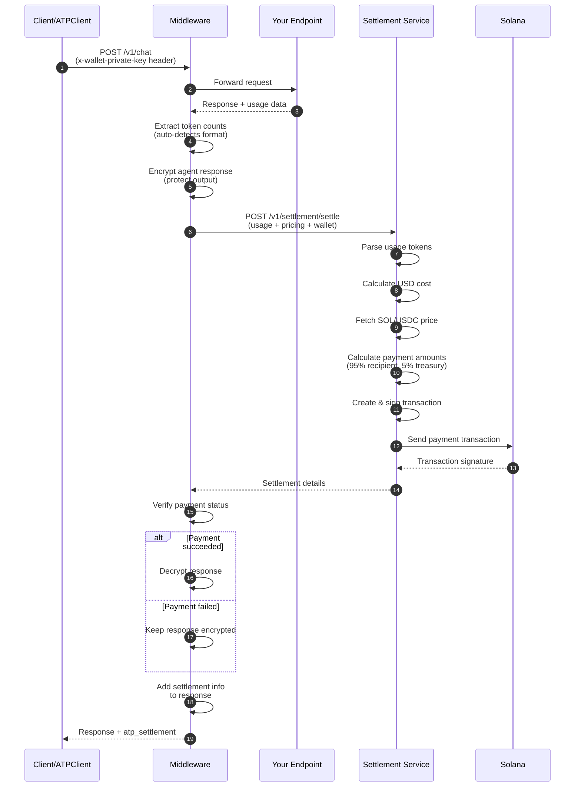
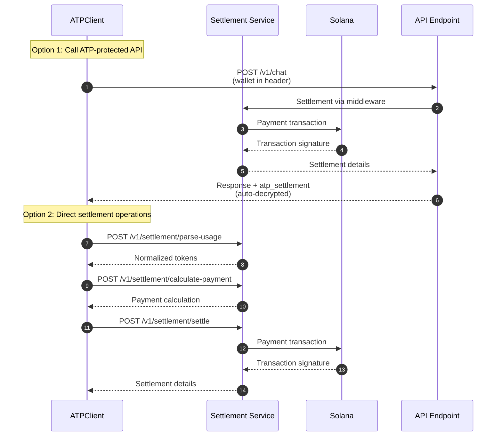

# ATP Protocol

**ATP (Agent Transaction Protocol)** enables automatic payment processing for AI agent APIs on Solana. Add billing to any FastAPI endpoint with a few lines of code, and integrate payment infrastructure for client applications.

> **Part of the [Swarms.ai](https://swarms.ai) ecosystem** - ATP Protocol is built for the [Swarms](https://github.com/kyegomez/swarms) multi-agent orchestration framework, providing seamless payment infrastructure for agent-to-agent transactions.

## What It Does

ATP Protocol makes it easy to charge for API usage:

- **Automatic billing** - Payment is processed automatically after each request
- **Solana payments** - Uses SOL or USDC for fast, cheap transactions
- **Token-based pricing** - Charges based on input/output token usage
- **Response encryption** - Agent responses are encrypted until payment is confirmed
- **Payment verification** - Responses are only decrypted after successful payment
- **Zero infrastructure** - No payment processors, no databases, just Solana
- **Client SDK** - Full-featured client for calling ATP-protected endpoints and settlement operations
- **Settlement Service** - Ultra-fast Rust-powered facilitator at `https://facilitator.swarms.world`


## Quick Start

Install the package:

```bash
pip install atp-protocol
```

## Server Usage (Add Billing to Your API)

Add automatic billing to your FastAPI endpoints with the ATP middleware:

```python
from fastapi import FastAPI
from atp.middleware import ATPSettlementMiddleware
from atp.schemas import PaymentToken

app = FastAPI()

# Add the middleware
app.add_middleware(
    ATPSettlementMiddleware,
    allowed_endpoints=["/v1/chat", "/v1/completions"],
    input_cost_per_million_usd=10.0,   # $10 per million input tokens
    output_cost_per_million_usd=30.0,  # $30 per million output tokens
    recipient_pubkey="YourSolanaWalletHere",  # Your wallet receives 95%
    payment_token=PaymentToken.SOL,
)

# Your endpoint just needs to return usage data
@app.post("/v1/chat")
async def chat(request: dict):
    return {
        "output": "Response here",
        "usage": {
            "input_tokens": 150,
            "output_tokens": 50,
        }
    }
```

**Response includes payment details (decrypted after payment):**

```json
{
  "output": "Response here",
  "usage": {"input_tokens": 150, "output_tokens": 50},
  "atp_settlement": {
    "status": "paid",
    "transaction_signature": "5j7s8K9...",
    "payment": {
      "total_amount_sol": 0.0003,
      "recipient": {"amount_sol": 0.000285},
      "treasury": {"amount_sol": 0.000015}
    }
  }
}
```

---

## Client Usage (Call ATP-Protected APIs)

Use the ATP client to call protected endpoints and handle payments automatically:

```python
import asyncio
from atp.client import ATPClient
from atp.schemas import PaymentToken

# Initialize client with your wallet
client = ATPClient(
    wallet_private_key="[1,2,3,...]",  # Your Solana wallet private key
    settlement_service_url="https://facilitator.swarms.world"
)

async def main():
    # Call an ATP-protected endpoint
    # Wallet is automatically included, response is auto-decrypted
    response = await client.post(
        url="http://localhost:8000/v1/chat",
        json={"message": "Hello!"}
    )
    
    print(response["output"])  # Decrypted agent output
    print(response["atp_settlement"])  # Payment details

asyncio.run(main())
```

**Alternative: Direct Settlement Service Operations**

You can also use the client to interact with the settlement service directly:

```python
import asyncio
from atp.client import ATPClient
from atp.schemas import PaymentToken

client = ATPClient(wallet_private_key="[1,2,3,...]")

async def main():
    # Parse usage from any format (OpenAI, Anthropic, Google, etc.)
    usage = await client.parse_usage({
        "prompt_tokens": 1000,
        "completion_tokens": 500
    })
    # Returns: {"input_tokens": 1000, "output_tokens": 500, "total_tokens": 1500}
    
    # Calculate payment without executing
    payment = await client.calculate_payment(
        usage=usage,
        input_cost_per_million_usd=10.0,
        output_cost_per_million_usd=30.0,
        payment_token=PaymentToken.SOL
    )
    print(f"Cost: ${payment['pricing']['usd_cost']}")
    
    # Execute settlement directly
    result = await client.settle(
        usage=usage,
        input_cost_per_million_usd=10.0,
        output_cost_per_million_usd=30.0,
        recipient_pubkey="RecipientWalletHere",
        payment_token=PaymentToken.SOL
    )
    print(f"Transaction: {result['transaction_signature']}")
    
    # Health check
    health = await client.health_check()
    print(f"Service status: {health['status']}")

asyncio.run(main())
```

**If payment fails, response remains encrypted:**

```json
{
  "output": "encrypted_data_here...",
  "usage": {"input_tokens": 150, "output_tokens": 50},
  "atp_settlement": {
    "error": "Settlement failed",
    "message": "Insufficient funds"
  },
  "atp_settlement_status": "failed",
  "atp_message": "Agent response is encrypted. Payment required to decrypt. Please provide a valid wallet private key and ensure payment succeeds."
}
```

That's it! Payment is automatically processed on Solana, and responses are protected until payment is confirmed.

---

## Quick Reference

### Server Setup (3 lines)

```python
from atp.middleware import ATPSettlementMiddleware
from atp.schemas import PaymentToken

app.add_middleware(
    ATPSettlementMiddleware,
    allowed_endpoints=["/v1/chat"],
    input_cost_per_million_usd=10.0,
    output_cost_per_million_usd=30.0,
    recipient_pubkey="YourWalletHere",
    payment_token=PaymentToken.SOL
)
```

### Client Setup (3 lines)

```python
from atp.client import ATPClient

client = ATPClient(wallet_private_key="[1,2,3,...]")
response = await client.post("http://api.example.com/v1/chat", json={"message": "Hi"})
```

### Direct Settlement (1 line)

```python
result = await client.settle(usage={...}, input_cost_per_million_usd=10.0, output_cost_per_million_usd=30.0, recipient_pubkey="...")
```

### Key Features

| Feature | Server (Middleware) | Client (ATPClient) |
|---------|-------------------|-------------------|
| **Automatic billing** | ✅ Intercepts responses | ✅ Calls protected APIs |
| **Response encryption** | ✅ Until payment confirmed | ✅ Auto-decrypts |
| **Usage parsing** | ✅ Auto-detects format | ✅ `parse_usage()` |
| **Payment calculation** | ✅ Automatic | ✅ `calculate_payment()` |
| **Settlement** | ✅ Automatic | ✅ `settle()` |
| **Health check** | ❌ | ✅ `health_check()` |
| **Direct API calls** | ❌ | ✅ `request()`, `post()`, `get()` |

---

## How It Works

The ATP Protocol uses a **Settlement Service** (facilitator) to handle all payment logic. The protocol supports two integration patterns:

### Pattern 1: Server-Side (Middleware)

The middleware automatically handles billing for your API endpoints:



### Pattern 2: Client-Side (Direct Settlement)

The client can interact with the settlement service directly:



### Step-by-Step (Middleware Pattern)

1. **Client sends request** with wallet private key in header (or uses `ATPClient`)
2. **Middleware intercepts** and forwards to your endpoint
3. **Your endpoint executes** and returns response with usage data
4. **Middleware extracts** token counts (supports OpenAI, Anthropic, Google formats)
5. **Middleware encrypts** agent response to protect output until payment is confirmed
6. **Settlement Service parses** usage from any API format
7. **Settlement Service calculates** cost from token usage and pricing rates
8. **Settlement Service fetches** current SOL/USDC price
9. **Settlement Service splits** payment: 95% to recipient, 5% to treasury
10. **Settlement Service creates & signs** Solana transaction
11. **Settlement Service sends** transaction to Solana network
12. **Middleware verifies** payment status from settlement service
13. **If payment succeeded**: Middleware decrypts response and returns it
14. **If payment failed**: Response remains encrypted with error message
15. **Middleware adds** settlement info to response

### Architecture

```mermaid
flowchart TB
    subgraph "Client Applications"
        AC[ATPClient SDK]
        HC[HTTP Client]
    end
    
    subgraph "ATP Server"
        M[ATP Middleware]
        E[Your API Endpoint]
    end
    
    subgraph "Settlement Infrastructure"
        SS[Settlement Service<br/>facilitator.swarms.world]
        S[Solana Blockchain]
    end
    
    subgraph "Payment Recipients"
        R[Your Wallet<br/>95%]
        T[Swarms Treasury<br/>5%]
    end
    
    AC -->|request() with wallet| M
    HC -->|Request + wallet header| M
    AC -.->|Direct: parse_usage()<br/>calculate_payment()<br/>settle()| SS
    
    M -->|Forward| E
    E -->|Response + Usage| M
    M -->|Settlement Request| SS
    SS -->|Payment Transaction| S
    S -.->|Split Payment| R
    S -.->|Split Payment| T
    SS -->|Settlement Details| M
    M -->|Response + Payment Info| AC
    M -->|Response + Payment Info| HC
    
    style SS fill:#f9f,stroke:#333,stroke-width:2px
    style AC fill:#bbf,stroke:#333,stroke-width:2px
```

### Settlement Service

The **Settlement Service** (facilitator) is a centralized, immutable service that handles:

- **Usage parsing**: Auto-detects and normalizes token counts from OpenAI, Anthropic, Google, Cohere formats
- **Payment calculation**: Converts token usage to USD cost to token amount
- **Price fetching**: Gets current SOL/USDC prices from oracles
- **Transaction execution**: Creates, signs, and sends Solana transactions
- **Payment verification**: Confirms transaction success with appropriate commitment level

The official facilitator at **`https://facilitator.swarms.world`** is ultra-fast and powered by Rust, ensuring low-latency payment processing. This centralized design keeps your middleware simple and ensures all settlement logic is immutable and consistent.

---

## ATP Client API

The `ATPClient` provides a high-level Python interface for:
- Calling ATP-protected endpoints with automatic wallet authentication
- Interacting with the settlement service directly
- Parsing usage data, calculating payments, and executing settlements

### Installation & Setup

```python
from atp.client import ATPClient
from atp.schemas import PaymentToken

# Initialize with wallet
client = ATPClient(
    wallet_private_key="[1,2,3,...]",  # Your Solana wallet (JSON array or base58)
    settlement_service_url="https://facilitator.swarms.world",  # Optional, defaults to env
    settlement_timeout=300.0,  # Optional, 5 minutes default
    verbose=False  # Set True for detailed logging
)
```

### Client Methods

#### `request()` - Call ATP-Protected Endpoints

Make HTTP requests to ATP-protected APIs with automatic wallet authentication and response decryption:

```python
# POST request
response = await client.post(
    url="https://api.example.com/v1/chat",
    json={"message": "Hello!"}
)

# GET request  
response = await client.get(
    url="https://api.example.com/v1/status",
    params={"id": "123"}
)

# Generic request
response = await client.request(
    method="POST",
    url="https://api.example.com/v1/chat",
    json={"message": "Hello!"},
    auto_decrypt=True  # Automatically decrypt encrypted responses
)
```

**Features:**
- Automatically adds wallet authentication headers
- Auto-decrypts encrypted responses from ATP middleware
- Supports all HTTP methods (GET, POST, PUT, DELETE, etc.)
- Full `httpx` kwargs support (headers, params, json, data, etc.)

#### `parse_usage()` - Parse Usage from Any Format

Parse usage tokens from various API response formats:

```python
usage = await client.parse_usage({
    "prompt_tokens": 1000,      # OpenAI format
    "completion_tokens": 500,
    "total_tokens": 1500
})
# Returns: {"input_tokens": 1000, "output_tokens": 500, "total_tokens": 1500}

# Also supports nested formats
usage = await client.parse_usage({
    "response": "Agent output here",
    "usage": {
        "input_tokens": 1000,
        "output_tokens": 500
    }
})
```

**Supported Formats:**
- OpenAI: `prompt_tokens`, `completion_tokens`
- Anthropic: `input_tokens`, `output_tokens`
- Google/Gemini: `promptTokenCount`, `candidatesTokenCount`
- Cohere: `tokens`, `input_tokens`, `output_tokens`
- Nested: `usage.usage`, `meta.usage`, `statistics.*`

#### `calculate_payment()` - Calculate Payment Amounts

Calculate payment amounts without executing the transaction:

```python
result = await client.calculate_payment(
    usage={"input_tokens": 1000, "output_tokens": 500},
    input_cost_per_million_usd=10.0,
    output_cost_per_million_usd=30.0,
    payment_token=PaymentToken.SOL
)

print(f"USD Cost: ${result['pricing']['usd_cost']}")
print(f"SOL Amount: {result['payment_amounts']['total_amount_token']}")
```

**Returns:**
```python
{
    "status": "calculated",
    "pricing": {
        "usd_cost": 0.025,  # $0.01 input + $0.015 output
        "input_tokens": 1000,
        "output_tokens": 500,
        "input_cost_per_million_usd": 10.0,
        "output_cost_per_million_usd": 30.0
    },
    "payment_amounts": {
        "total_amount_token": 0.00125,      # Total in SOL
        "treasury_amount_token": 0.0000625,  # 5% fee
        "recipient_amount_token": 0.0011875  # 95% to recipient
    },
    "token_price_usd": 20.0  # Current SOL price
}
```

#### `settle()` - Execute Settlement Payment

Execute a complete settlement transaction on Solana:

```python
result = await client.settle(
    usage={"input_tokens": 1000, "output_tokens": 500},
    input_cost_per_million_usd=10.0,
    output_cost_per_million_usd=30.0,
    recipient_pubkey="RecipientWalletPublicKeyHere",
    payment_token=PaymentToken.SOL,
    commitment="confirmed"  # processed|confirmed|finalized
)

print(f"Transaction: {result['transaction_signature']}")
print(f"Status: {result['status']}")  # "paid"
```

**Parameters:**
- `usage`: Token usage data (any supported format)
- `input_cost_per_million_usd`: Input token pricing rate
- `output_cost_per_million_usd`: Output token pricing rate
- `recipient_pubkey`: Recipient wallet address (receives 95%)
- `payment_token`: `PaymentToken.SOL` or `PaymentToken.USDC`
- `skip_preflight`: Skip transaction simulation (default: `False`)
- `commitment`: Confirmation level (`"confirmed"` recommended)

**Returns:**
```python
{
    "status": "paid",
    "transaction_signature": "5j7s8K9mL3nP...",
    "pricing": {...},  # Cost breakdown
    "payment": {
        "total_amount_sol": 0.00125,
        "recipient": {
            "pubkey": "RecipientWalletPublicKeyHere",
            "amount_sol": 0.0011875,
            "amount_lamports": 1187500
        },
        "treasury": {
            "pubkey": "TreasuryWalletPublicKeyHere",
            "amount_sol": 0.0000625,
            "amount_lamports": 62500
        }
    }
}
```

#### `health_check()` - Check Service Health

Verify the settlement service is operational:

```python
health = await client.health_check()
print(f"Status: {health['status']}")      # "healthy"
print(f"Service: {health['service']}")    # "ATP Settlement Service"
print(f"Version: {health['version']}")    # "1.0.0"
```

### Error Handling

The client raises `SettlementServiceError` for all settlement service errors:

```python
from atp.settlement_client import SettlementServiceError

try:
    result = await client.settle(...)
except SettlementServiceError as e:
    print(f"Error type: {e.error_type}")       # "Timeout", "Invalid request", etc.
    print(f"Status code: {e.status_code}")     # HTTP status code
    print(f"Detail: {e.error_detail}")         # Detailed error message
    
    # Convert to dict for API responses
    error_dict = e.to_dict()
```

**Common Error Types:**
- `"Timeout"`: Payment may have succeeded, check blockchain
- `"Invalid request"`: Bad parameters or format (400)
- `"Authentication error"`: Auth failed (401)
- `"Client error"`: Other client errors (4xx)
- `"Server error"`: Settlement service errors (5xx)
- `"Connection error"`: Service unreachable

### Complete Client Example

```python
import asyncio
from atp.client import ATPClient
from atp.schemas import PaymentToken
from atp.settlement_client import SettlementServiceError

async def main():
    # Initialize client
    client = ATPClient(
        wallet_private_key="[1,2,3,...]",
        verbose=True  # Enable detailed logging
    )
    
    try:
        # Health check
        health = await client.health_check()
        print(f"✓ Service healthy: {health['status']}")
        
        # Parse usage
        usage = await client.parse_usage({
            "prompt_tokens": 1000,
            "completion_tokens": 500
        })
        print(f"✓ Parsed usage: {usage}")
        
        # Calculate payment
        calc = await client.calculate_payment(
            usage=usage,
            input_cost_per_million_usd=10.0,
            output_cost_per_million_usd=30.0,
            payment_token=PaymentToken.SOL
        )
        print(f"✓ Cost: ${calc['pricing']['usd_cost']} = {calc['payment_amounts']['total_amount_token']} SOL")
        
        # Execute settlement
        result = await client.settle(
            usage=usage,
            input_cost_per_million_usd=10.0,
            output_cost_per_million_usd=30.0,
            recipient_pubkey="RecipientPublicKeyHere",
            payment_token=PaymentToken.SOL
        )
        print(f"✓ Payment sent: {result['transaction_signature']}")
        
        # Call ATP-protected endpoint
        response = await client.post(
            url="https://api.example.com/v1/chat",
            json={"message": "Hello!"}
        )
        print(f"✓ Response: {response['output']}")
        print(f"✓ Settlement: {response['atp_settlement']['status']}")
        
    except SettlementServiceError as e:
        print(f"✗ Settlement error: {e.error_type}")
        print(f"  Detail: {e.error_detail}")
    except Exception as e:
        print(f"✗ Unexpected error: {e}")

asyncio.run(main())
```

---

## Middleware Configuration

### Required Parameters

| Parameter | Description |
| --------- | ----------- |
| `allowed_endpoints` | List of endpoint paths to apply settlement (e.g., `["/v1/chat"]`) |
| `input_cost_per_million_usd` | Cost per million input tokens in USD |
| `output_cost_per_million_usd` | Cost per million output tokens in USD |
| `recipient_pubkey` | Your Solana wallet address (receives 95% of payment) |

### Optional Parameters

| Parameter | Default | Description |
| --------- | ------- | ----------- |
| `wallet_private_key_header` | `x-wallet-private-key` | HTTP header name for wallet key |
| `payment_token` | `PaymentToken.SOL` | `PaymentToken.SOL` or `PaymentToken.USDC` |
| `require_wallet` | `True` | Require wallet key or skip settlement when missing |
| `settlement_service_url` | From `ATP_SETTLEMENT_URL` env | Settlement service URL |
| `settlement_timeout` | From `ATP_SETTLEMENT_TIMEOUT` env or `300.0` | Timeout in seconds for settlement requests (default: 5 minutes) |
| `fail_on_settlement_error` | `False` | If `True`, raises HTTPException on settlement failure; if `False`, returns encrypted response with error |
| `skip_preflight` | `False` | Skip Solana transaction preflight simulation |
| `commitment` | `"confirmed"` | Solana commitment level (`processed`\|`confirmed`\|`finalized`) |

### Environment Variables

Both the middleware and client support these environment variables:

```bash
# Settlement Service URL (default: https://facilitator.swarms.world)
# The official facilitator is ultra-fast and powered by Rust
ATP_SETTLEMENT_URL="https://facilitator.swarms.world"

# Settlement Service Timeout (default: 300.0 seconds / 5 minutes)
# Settlement operations may take longer due to blockchain confirmation times
# Increase this value if you experience timeout errors even when payments succeed
ATP_SETTLEMENT_TIMEOUT="300.0"

# Client: Wallet Private Key (optional, can be passed to client directly)
# JSON array format: "[1,2,3,...]" or base58 string
ATP_PRIVATE_KEY="[1,2,3,...]"
```

**Using environment variables with the client:**

```python
import os
from atp.client import ATPClient

# Load from environment
client = ATPClient(
    wallet_private_key=os.getenv("ATP_PRIVATE_KEY"),
    # settlement_service_url automatically uses ATP_SETTLEMENT_URL
    # settlement_timeout automatically uses ATP_SETTLEMENT_TIMEOUT
)
```

**Using a `.env` file:**

```bash
# .env
ATP_SETTLEMENT_URL=https://facilitator.swarms.world
ATP_SETTLEMENT_TIMEOUT=300.0
ATP_PRIVATE_KEY=[1,2,3,...]
```

```python
from dotenv import load_dotenv
from atp.client import ATPClient

load_dotenv()

client = ATPClient(
    wallet_private_key=os.getenv("ATP_PRIVATE_KEY")
)
```

---

## Payment Calculation

The middleware calculates cost from token usage:

```text
usd_cost = (input_tokens / 1,000,000 × input_rate) + (output_tokens / 1,000,000 × output_rate)
token_amount = usd_cost / token_price_usd
```

**Payment Split:**

- **95%** → Your wallet (`recipient_pubkey`)
- **5%** → Swarms Treasury (processing fee)

The fee is **deducted from the total** (not added on top).

### Example

If a request uses 1,000 input tokens and 500 output tokens:

- Input cost: `1,000 / 1,000,000 × $10 = $0.01`
- Output cost: `500 / 1,000,000 × $30 = $0.015`
- **Total: $0.025 USD**

At SOL price of $100:

- Payment: `$0.025 / $100 = 0.00025 SOL`
- You receive: `0.00025 × 0.95 = 0.0002375 SOL`
- Treasury receives: `0.00025 × 0.05 = 0.0000125 SOL`

---

## Supported Usage Formats

The middleware automatically detects usage from common API formats:

- **OpenAI**: `prompt_tokens`, `completion_tokens`, `total_tokens`
- **Anthropic**: `input_tokens`, `output_tokens`, `total_tokens`
- **Google/Gemini**: `promptTokenCount`, `candidatesTokenCount`, `totalTokenCount`
- **Generic**: `input_tokens`, `output_tokens`, `total_tokens`
- **Nested**: `usage.*`, `meta.usage`, `statistics.*`

Your endpoint can return usage in any of these formats - the middleware will find it.

---

## Complete Examples

### Server Example (FastAPI + Middleware)

Create `server.py`:

```python
from fastapi import FastAPI, JSONResponse
from atp.middleware import ATPSettlementMiddleware
from atp.schemas import PaymentToken

app = FastAPI()

# Configure middleware
app.add_middleware(
    ATPSettlementMiddleware,
    allowed_endpoints=["/v1/chat"],
    input_cost_per_million_usd=10.0,
    output_cost_per_million_usd=30.0,
    recipient_pubkey="YourSolanaWalletHere",  # Your wallet
    payment_token=PaymentToken.SOL,
    fail_on_settlement_error=False,  # Return encrypted response on error
    settlement_timeout=300.0,  # 5 minutes timeout
)

@app.post("/v1/chat")
async def chat(request: dict):
    # Your business logic here
    message = request.get("message", "")
    
    # Simulate API call that returns usage
    response_data = {
        "output": f"You said: {message}",
        "usage": {
            "input_tokens": len(message.split()) * 2,  # Rough estimate
            "output_tokens": 50,
            "total_tokens": len(message.split()) * 2 + 50,
        }
    }
    
    return JSONResponse(content=response_data)

if __name__ == "__main__":
    import uvicorn
    uvicorn.run(app, host="0.0.0.0", port=8000)
```

**Run the server:**

```bash
python server.py
```

### Client Example (ATPClient)

Create `client.py`:

```python
import asyncio
from atp.client import ATPClient
from atp.schemas import PaymentToken

async def main():
    # Initialize client with your wallet
    client = ATPClient(
        wallet_private_key="[1,2,3,...]",  # Your Solana wallet
        verbose=True  # Enable logging
    )
    
    # Call the ATP-protected endpoint
    print("Making request to ATP-protected endpoint...")
    response = await client.post(
        url="http://localhost:8000/v1/chat",
        json={"message": "Hello, world!"}
    )
    
    # Response is automatically decrypted
    print(f"\n✓ Agent Output: {response['output']}")
    print(f"✓ Usage: {response['usage']}")
    print(f"✓ Settlement Status: {response['atp_settlement']['status']}")
    
    if response['atp_settlement']['status'] == 'paid':
        print(f"✓ Transaction: {response['atp_settlement']['transaction_signature']}")
        print(f"✓ Payment: {response['atp_settlement']['payment']['total_amount_sol']} SOL")

if __name__ == "__main__":
    asyncio.run(main())
```

**Run the client:**

```bash
python client.py
```

### Alternative: Using cURL

```bash
curl -X POST http://localhost:8000/v1/chat \
  -H "Content-Type: application/json" \
  -H "x-wallet-private-key: [1,2,3,...]" \
  -d '{"message": "Hello, world!"}'
```

### Direct Settlement Example

You can also use the client to interact with the settlement service directly:

```python
import asyncio
from atp.client import ATPClient
from atp.schemas import PaymentToken
from atp.settlement_client import SettlementServiceError

async def main():
    client = ATPClient(wallet_private_key="[1,2,3,...]")
    
    try:
        # Step 1: Parse usage
        print("Step 1: Parsing usage...")
        usage = await client.parse_usage({
            "prompt_tokens": 1000,
            "completion_tokens": 500
        })
        print(f"✓ Parsed: {usage}")
        
        # Step 2: Calculate payment
        print("\nStep 2: Calculating payment...")
        calc = await client.calculate_payment(
            usage=usage,
            input_cost_per_million_usd=10.0,
            output_cost_per_million_usd=30.0,
            payment_token=PaymentToken.SOL
        )
        print(f"✓ USD Cost: ${calc['pricing']['usd_cost']}")
        print(f"✓ SOL Amount: {calc['payment_amounts']['total_amount_token']}")
        
        # Step 3: Execute settlement
        print("\nStep 3: Executing settlement...")
        result = await client.settle(
            usage=usage,
            input_cost_per_million_usd=10.0,
            output_cost_per_million_usd=30.0,
            recipient_pubkey="RecipientWalletPublicKeyHere",
            payment_token=PaymentToken.SOL
        )
        print(f"✓ Status: {result['status']}")
        print(f"✓ Transaction: {result['transaction_signature']}")
        print(f"✓ Total: {result['payment']['total_amount_sol']} SOL")
        print(f"✓ Recipient: {result['payment']['recipient']['amount_sol']} SOL")
        print(f"✓ Treasury: {result['payment']['treasury']['amount_sol']} SOL")
        
    except SettlementServiceError as e:
        print(f"\n✗ Error: {e.error_type}")
        print(f"  Detail: {e.error_detail}")

if __name__ == "__main__":
    asyncio.run(main())
```

### Swarms Framework Integration

For a complete example showing how to integrate ATP Protocol with [Swarms](https://github.com/kyegomez/swarms) agents, see:

**[examples/example.py](examples/example.py)** or **[example.py](example.py)** (root directory)

This example demonstrates:

- Setting up a Swarms agent
- Creating FastAPI endpoints that use the agent
- Automatic payment processing with ATP middleware
- Usage tracking and billing for agent services

**Quick start with Swarms:**

```bash
# Install dependencies
pip install swarms atp-protocol

# Set your OpenAI API key
export OPENAI_API_KEY="your-key-here"

# Run the example
python examples/example.py
# or
python example.py
```

---

## Examples

ATP Protocol includes comprehensive examples showing how to integrate with various AI agent frameworks and APIs. All examples demonstrate automatic payment processing, token usage tracking, and Solana settlement using both the middleware and `ATPClient`.

### Framework Integration Examples

| Framework | Directory | Description | Documentation |
|-----------|-----------|-------------|--------------|
| **Swarms** | [`swarms/`](swarms/) | Swarms framework integration with native ATP support and ATPClient | [README](swarms/README.md) |
| **LangChain** | [`examples/tutorials/langchain/`](examples/tutorials/langchain/) | LangChain agent integration with tools and conversational interface | [README](examples/tutorials/langchain/README.md) |
| **AutoGen** | [`examples/tutorials/autogen/`](examples/tutorials/autogen/) | AutoGen multi-agent conversation framework integration | [README](examples/tutorials/autogen/README.md) |
| **CrewAI** | [`examples/tutorials/crewai/`](examples/tutorials/crewai/) | CrewAI multi-agent crew workflows and task pipelines | [README](examples/tutorials/crewai/README.md) |
| **Anthropic API** | [`examples/tutorials/anthropic/`](examples/tutorials/anthropic/) | Direct integration with Anthropic's Claude API | [README](examples/tutorials/anthropic/README.md) |

### Client Examples

| Example | File | Description |
|---------|------|-------------|
| **Client SDK** | [`swarms/client.py`](swarms/client.py) | ATPClient usage with automatic settlement |
| **Client Operations** | [`examples/client/`](examples/client/) | Parse usage, calculate payment, settle operations |
| **Health Check** | [`examples/client/example_health_check.py`](examples/client/example_health_check.py) | Settlement service health check |
| **Parse Usage** | [`examples/client/example_parse_usage.py`](examples/client/example_parse_usage.py) | Parse usage from various formats |
| **Calculate Payment** | [`examples/client/example_calculate_payment.py`](examples/client/example_calculate_payment.py) | Calculate payment amounts |
| **Execute Settlement** | [`examples/client/example_settle.py`](examples/client/example_settle.py) | Execute settlement transaction |
| **Make Request** | [`examples/client/example_request.py`](examples/client/example_request.py) | Call ATP-protected endpoints |

### Server Examples

| Example | File | Description |
|---------|------|-------------|
| **Swarms Integration** | [`example.py`](example.py) | Complete Swarms framework integration example |
| **Full Flow** | [`examples/server/full_flow_example.py`](examples/server/full_flow_example.py) | End-to-end payment flow demonstration |
| **Settlement Service** | [`examples/server/settlement_service_example.py`](examples/server/settlement_service_example.py) | Direct settlement service usage |
| **Client Smoke Test** | [`examples/server/client_smoke_test.py`](examples/server/client_smoke_test.py) | Server testing and validation |

### Quick Start with Examples

Each framework example includes:
- **Server** (`server.py`) - FastAPI server with ATP middleware configured
- **Client** (`client.py`) - ATPClient example with wallet authentication
- **README** - Framework-specific setup and usage instructions
- **TUTORIAL** - Step-by-step integration guide

**Getting started:**

1. Navigate to an example directory:
   ```bash
   cd swarms  # or examples/tutorials/langchain, etc.
   ```

2. Install dependencies (see example's README for specific requirements):
   ```bash
   pip install atp-protocol swarms  # or langchain, autogen, crewai
   ```

3. Configure environment variables:
   ```bash
   # Create .env file
   OPENAI_API_KEY="your-key"  # For Swarms, LangChain, AutoGen, CrewAI
   ANTHROPIC_API_KEY="your-key"  # For Anthropic
   ATP_PRIVATE_KEY="[1,2,3,...]"  # Your wallet private key
   ATP_SETTLEMENT_URL="https://facilitator.swarms.world"  # Optional
   ```

4. Update `recipient_pubkey` in `server.py` with your Solana wallet address

5. Run the server:
   ```bash
   python server.py
   ```

6. Test with the client:
   ```bash
   python client.py
   ```

**Client-only examples:**

```bash
cd examples/client
python example_health_check.py    # Check service health
python example_parse_usage.py     # Parse usage data
python example_calculate_payment.py  # Calculate payment
python example_settle.py           # Execute settlement
python example_request.py          # Call ATP-protected endpoint
```

For detailed instructions, see the [Examples README](examples/README.md) or the framework-specific README in each example directory.

---

## Response Encryption & Payment Verification

ATP Protocol includes built-in **response encryption** to ensure users cannot access agent output until payment is confirmed. This provides strong protection against payment fraud.

### How It Works

1. **After endpoint execution**: The middleware encrypts sensitive response fields (e.g., `output`, `response`, `result`, `message`) before processing payment
2. **Payment processing**: Settlement is attempted via the Settlement Service
3. **Payment verification**: The middleware checks if payment status is `"paid"` and a transaction signature exists
4. **Conditional decryption**:
   - ✅ **Payment succeeded**: Response is decrypted and returned to client
   - ❌ **Payment failed**: Response remains encrypted with error message

### Encrypted Response Format

When payment fails, the response includes encrypted data and a clear message:

```json
{
  "output": "encrypted_data_here...",
  "usage": {"input_tokens": 150, "output_tokens": 50},
  "atp_settlement": {
    "error": "Settlement service unavailable",
    "message": "Request timed out after 300.0s. The payment may have been sent successfully, but the settlement service did not respond in time.",
    "type": "ReadTimeout"
  },
  "atp_settlement_status": "failed",
  "atp_message": "Agent response is encrypted. Payment required to decrypt. Please provide a valid wallet private key and ensure payment succeeds."
}
```

### Settlement Error Handling

The middleware provides flexible error handling via the `fail_on_settlement_error` parameter:

- **`fail_on_settlement_error=False`** (default):
  - Returns encrypted response with error details
  - Client receives usage data and error information
  - Useful for debugging and graceful degradation

- **`fail_on_settlement_error=True`**:
  - Raises `HTTPException` (500) when settlement fails
  - Request fails immediately
  - Useful for strict payment requirements

### Timeout Handling

Settlement operations may take time due to blockchain confirmation. The middleware provides informative timeout messages:

- **ReadTimeout**: Payment may have succeeded, but settlement service didn't respond in time
- **ConnectTimeout**: Settlement service is unreachable
- **HTTP errors**: Network or service errors with status codes

Increase `settlement_timeout` if you experience timeouts even when payments succeed.

---

## Error Handling

### Middleware Error Handling

| Error Scenario              | Behavior                                                                                                              |
|----------------------------|-----------------------------------------------------------------------------------------------------------------------|
| **Missing wallet key**      | Returns `402 Payment Required` with error message                                                                     |
| **Missing usage data**      | Logs warning and returns original response (no settlement)                                                           |
| **Payment failure**         | If `fail_on_settlement_error=False`: Returns encrypted response with error details  <br> If `fail_on_settlement_error=True`: Returns `500 Internal Server Error` and raises exception |
| **Invalid private key**     | Returns `500 Internal Server Error` with parsing error                                                               |
| **Encryption failure**      | Returns `500 Internal Server Error` without exposing agent output                                                    |
| **Settlement timeout**      | Returns encrypted response with timeout message (payment may have succeeded)                                         |

### Client Error Handling

The `ATPClient` raises `SettlementServiceError` for all settlement-related errors. This exception provides structured error information:

```python
from atp.client import ATPClient
from atp.settlement_client import SettlementServiceError

client = ATPClient(wallet_private_key="[1,2,3,...]")

try:
    result = await client.settle(
        usage={"input_tokens": 1000, "output_tokens": 500},
        input_cost_per_million_usd=10.0,
        output_cost_per_million_usd=30.0,
        recipient_pubkey="RecipientWalletHere"
    )
except SettlementServiceError as e:
    # Structured error information
    print(f"Error type: {e.error_type}")      # "Timeout", "Invalid request", etc.
    print(f"Status code: {e.status_code}")    # HTTP status code
    print(f"Detail: {e.error_detail}")        # Detailed error message
    
    # Convert to dict for API responses
    error_dict = e.to_dict()
    # {"error": "Timeout", "message": "...", "detail": "...", "status_code": 408}
```

**Common Error Types:**

| Error Type              | Status Code | Description                                      | Action                                    |
|------------------------|-------------|--------------------------------------------------|-------------------------------------------|
| **Timeout**            | None        | Settlement service timed out                     | Payment may have succeeded, check blockchain |
| **Connection timeout** | None        | Failed to connect to service                     | Service may be down or unreachable        |
| **Connection error**   | None        | Network error                                    | Check network connectivity                |
| **Invalid request**    | 400         | Bad parameters or format                         | Check request parameters                  |
| **Authentication error** | 401       | Authentication failed                            | Check wallet private key                  |
| **Authorization error** | 403        | Insufficient permissions                         | Check wallet permissions                  |
| **Not found**          | 404         | Resource not found                               | Check endpoint URL                        |
| **Client error**       | 4xx         | Other client errors                              | Review error detail                       |
| **Server error**       | 5xx         | Settlement service error                         | Service may be experiencing issues        |

---

## How the Settlement Service Works

The Settlement Service (facilitator) is a centralized API that handles all payment logic. The official facilitator service at **`https://facilitator.swarms.world`** is ultra-fast and powered by Rust, ensuring low-latency payment processing.

### Service Endpoints

| Endpoint                                     | Description                        | Used By            |
|----------------------------------------------|------------------------------------|--------------------|
| **POST /v1/settlement/parse-usage**          | Parse usage from various formats   | Middleware, Client |
| **POST /v1/settlement/calculate-payment**    | Calculate payment amounts          | Client             |
| **POST /v1/settlement/settle**               | Execute payment transaction        | Middleware, Client |
| **GET /health**                              | Health check                       | Client             |

The middleware calls these endpoints automatically during request processing. You can also call them directly using `ATPClient` for custom workflows.

### Settlement Service Flow

**Automatic (via Middleware):**
1. **Middleware intercepts** response from your endpoint
2. **Parse usage** - Normalize token counts from any format
3. **Calculate cost** - Convert tokens to USD using your rates
4. **Fetch token price** - Get current SOL/USDC price from oracle
5. **Calculate payment** - Convert USD to token amount
6. **Split payment** - Calculate 95%/5% split
7. **Create & sign transaction** - Build Solana transaction with private key
8. **Send transaction** - Submit to Solana network
9. **Verify** - Wait for confirmation at specified commitment level
10. **Decrypt response** - Unlock agent output after payment confirmation
11. **Return details** - Transaction signature and payment breakdown in response

**Manual (via ATPClient):**
1. **Client calls** `parse_usage()`, `calculate_payment()`, or `settle()`
2. **Service processes** request with same flow as above
3. **Client receives** structured response with payment details
4. **Client handles** response data as needed

All settlement logic is immutable and centralized in the service, ensuring consistency and reliability. The service is stateless - it does not store private keys, transaction history, or user data.

---

## Payment Tokens

ATP Protocol supports two payment tokens:

- **SOL** - Native Solana token (default)
- **USDC** - Stablecoin (treated as $1 USD)

Set `payment_token=PaymentToken.USDC` to use USDC instead of SOL.

---

## Security Considerations

| Security Aspect              | Details                                                           |
|------------------------------|-------------------------------------------------------------------|
| **Private keys**             | Only used in-memory during each request, never persisted          |
| **No key storage**           | Neither client, middleware, nor service stores private keys       |
| **Client key handling**      | `ATPClient` stores key in memory only during initialization       |
| **Settlement Service**       | Stateless service, handles signing and sending only              |
| **Response encryption**      | Agent outputs are encrypted until payment is confirmed            |
| **Payment verification**     | Responses are only decrypted after successful payment verification |
| **Transaction verification** | Ensures payments are confirmed before a response is returned      |
| **Encrypted failure mode**   | Failed payments keep responses encrypted, preventing output access |
| **HTTPS recommended**        | Use HTTPS for all communication to protect keys in transit        |
| **Key format flexibility**   | Supports JSON array and base58 formats for compatibility          |

### Best Practices

**For API Servers (Middleware):**
- Always use HTTPS in production to protect wallet keys in transit
- Set `fail_on_settlement_error=True` for strict payment requirements
- Configure `settlement_timeout` based on your use case
- Monitor settlement errors and adjust pricing as needed
- Use `recipient_pubkey` for your wallet to receive payments

**For Clients (ATPClient):**
- Store wallet private keys securely (environment variables, secure vaults)
- Never commit private keys to version control
- Use `.env` files with `.gitignore` for local development
- Consider using hardware wallets for high-value transactions
- Enable `verbose=True` during development for debugging
- Handle `SettlementServiceError` exceptions gracefully
- Check transaction signatures on blockchain for confirmation

**Key Management:**
```python
# ✓ Good: Load from environment
import os
from atp.client import ATPClient

client = ATPClient(
    wallet_private_key=os.getenv("ATP_PRIVATE_KEY")
)

# ✗ Bad: Hardcoded private key
client = ATPClient(
    wallet_private_key="[1,2,3,...]"  # Never do this!
)
```

---

## About Swarms

ATP Protocol is part of the **[Swarms](https://swarms.ai)** ecosystem, the enterprise-grade production-ready multi-agent orchestration framework. Swarms provides the infrastructure for building and deploying autonomous agents at scale.

- **Framework**: [Swarms on GitHub](https://github.com/kyegomez/swarms)
- **Documentation**: [docs.swarms.world](https://docs.swarms.world)
- **Website**: [swarms.ai](https://swarms.ai)

ATP Protocol integrates seamlessly with Swarms agents, enabling:
- **Agent-to-agent payments**: Automatic settlement for agent services
- **Billing infrastructure**: Token-based pricing for agent APIs
- **Client SDK**: `ATPClient` for calling agent services with automatic payment
- **Middleware**: Easy integration with FastAPI-based agent services
- **Settlement service**: Ultra-fast Rust-powered facilitator for payment processing

See the [Swarms example](swarms/) for a complete integration demo.

---

## License

See [LICENSE](LICENSE) file for details.
